= Entwicklerdokumentation
:project_name: Kleinreparaturen
:toc: left
:toc-title: Inhaltsverzeichnis
:numbered:

[options="header"]
[cols="1, 3, 3"]
|===
|Version | Bearbeitungsdatum   | Autor 
|1.0	|11.05.2024| Pritkumar Dobariya
|1.1  |12.05.2024| Vihar Kheni
|1.3  |20.05.2024| Pascal Jahn
|1.4  |26.05.2024| Philipp Danzmann
|2.0  |28.07.2024| Jannes Schöttke
|===

== Einleitung
Diese Dokumentation beschreibt die Anforderungen und Qualitätsstandards für die Entwicklung der Webanwendung für die Miss Mint Mending Points GmbH. Diese Dokumentation soll sowohl als Leitfaden für Entwickler als auch als Informationsquelle für andere Beteiligte wie Projektmanager und Tester dienen.

== Auftragsbeschreibung

=== Hauptziel
Das Ziel dieses Projekts ist die Entwicklung einer Webanwendung für die Miss Mint Mending Points GmbH. Diese Anwendung soll die Mitarbeiter bei den Prozessen Annahme, Ressourcen- und Filialverwaltung sowie Ausgabe und Warenlagerung unterstützen. Zusätzlich soll die Software dem Filialmanagement laufende und akkumulierte Bilanzen zur Verfügung stellen. Die Anwendung soll die Geschäftsprozesse digital abbilden und eine Datenbankverbindung integration, um Daten dauerhaft zu speichern

=== Nebenziel und Hauptanwender
Nebenziel ist die Informationsübermittlung von Bestellinformationen an den Kunden.

Hauptnutzer des Systems sind die Mitarbeiter und Administratoren/Manager des Unternehmens, die zur Handhabung lediglich grundlegendes Prozesswissen, sowie einen aktiven UserAccount benötigen.

=== Dienstleistungsangebot
Jeder Miss-Mint-Reparaturbetrieb bietet die folgenden Basisdienstleistungen an:

- Flickschusterei: Absätze, Sohlen, Nähte
- Nähservice: Knöpfe, Nähte, Flicken
- Schlüsseldienst: Schlüssel kopieren, Schilder gravieren
- Reiningungsservice: Wäsche, Anzüge, Leder
- Elektrowerkstatt: Kabel ersetzen, löten Scherenschleiferei: Scheren, Messer schärfen

=== Prozessübersicht

- **Annahme der Ware:**
Der Preis der gewünschten Dienstleistung wird sofort ermittelt und vom Kunden im Voraus bezahlt. Der Kunde erhält einen Auftragszettel mit einer eindeutigen Auftragsnummer und dem Fertigstellungstermin. Fertigstellung und Abholung:

- **Abholung:**
Ab dem Fertigstellungstermin kann die Ware eine Woche lang unter Vorlage des Auftragszettels abgeholt werden. Nach einer Woche wird die Ware für drei Monate in einer Aufbewahrungsstelle gelagert. Die Abholung erfolgt gegen Zahlung einer Aufbewahrungsgebühr von 1,50 € pro Woche. Waren, die auch in diesem Zeitraum nicht abgeholt werden, fallen an eine karitative Organisation. Erstattung bei Verzögerung:

- **Reparaturverzögerung:**
Für jeden vollen Tag, um den sich die Erbringung der Dienstleistung verspätet, werden 10 Prozent der Reparaturkosten zurückerstattet. Verwaltung der Ressourcen:

- **Ressourcenverwaltung:**
Das Filialmanagement ist verantwortlich für die Bereitstellung der Ressourcen (Personal, Arbeitsgerät, Material, Räume).

- **Buchhaltung:**
Der monatliche Reingewinn (nach Abzug der laufenden Kosten) wird an die Zentrale abgeführt.

== Anforderungen

=== Qualitätsanforderungen

==== Maintainability (Wartbarkeit)
Die Software soll einfach zu warten und zu erweitern sein, um zukünftige Anforderungen und Änderungen zu unterstützen.
Zielerreichung durch Verwendung von klaren Architekturmustern, sauberem Quellcode, Code-Reviews und umfassender Dokumentation.

==== Usability (Nutzbarkeit)
- Voranstellung: Die Web-Anwendung muss definierte Funktionen bereitstellen, um eine digitale Abwicklung der Geschäftsprozesse zu ermöglichen. Sie muss soweit zuverlässig sein, um einen unterbrechungsfreien Betrieb und eine hohe Verfügbarkeit sicherzustellen.
- Einfache und intuitive Benutzeroberfläche: Die Benutzeroberfläche der Web-Anwendung sollte so benutzerfreundlich gestaltet sein, das Personen mit ausreichendem Prozesswissen diese einfache und intuitive bedienen können.
- Performance: Die Anwendung muss effizient arbeiten und eine schnelle Verarbeitung von Transaktionen ermöglichen.

==== Security (Sicherheit)

- Authentifizierung und Autorisierung: Nur autorisierte Benutzer dürfen auf die Anwendung zugreifen und bestimmte Funktionen ausführen.
- Datenschutz: Schutz der Benutzerdaten vor unbefugtem Zugriff.
- Integration von Spring Security, um benutzerdefinierte Authentifizierungs- und Autorisierungsschemata zu implementieren und die Anwendung vor Sicherheitsbedrohungen zu schützen.
- Verschlüsselte Kommunikation: Verwendung des HTTPS-Standards zur sicheren Datenübertragung

==== Kompatibilität

- Entwickeln der Anwendung in Java für plattformunabhängige Ausführung auf verschiedenen Betriebssystemen und Geräten.
- Einsatz von Thymeleaf für serverseitiges Rendern von Templates, um eine konsistente Benutzererfahrung auf verschiedenen Geräten und Browsern sicherzustellen.

=== Randbedingungen
==== Hardware-Spezifikationen
Folgende Geräte sind für die Nutzung der Anwendung notwendig:

* Server
* Computer
* Bildschirm
* Tastatur
* Maus

==== Software-Spezifikationen
Folgende Software ist notwendig um die Anwendung auszuführen und zu verwenden.

* Java 17
* Apache Maven (mindestens Version 3.6.3)
* Spring Boot (mindestens Version 2.5.0)

Die folgenden (oder neuere) Browser-Versionen sind erforderlich, um die Anwendung zu verwenden:

* Edge 9.0
* Firefox 8.8
* Google Chrome 9.0
* Opera 7.5

==== Hardware-Anforderungen
Um das Projekt lokal ausführen und entwickeln zu können, sollten die folgenden Mindestanforderungen an die Hardware erfüllt werden:

* Prozessor: Quad-Core CPU, mindestens 2.5 GHz (z.B. Intel Core i5 oder AMD Ryzen 5)
* Arbeitsspeicher (RAM): Mindestens 8 GB RAM
* Festplattenspeicher: Mindestens 20 GB verfügbarer Speicherplatz
* Bildschirm: Mindestens 15 Zoll, 1920 x 1080 Pixel Auflösung

== Architekturentscheidungen

=== Architekturpattern
Die Architektur der Anwendung soll auf dem MVC-Pattern nach Spring MVC basieren.
Das MVC-Pattern (Model-View-Controller) unterteilt das Gesamtziel in unterschiedliche Schichten auf.
Dabei übernehmen die einzelnen Schichten folgende Aufgaben:

- Model: Repräsentiert die Geschäftslogik und die Datenbankzugriffe.
- View: Zuständig für die Darstellung der Daten und die Benutzerinteraktionen.
- Controller: Vermittelt zwischen Model und View und verarbeitet Benutzeranfragen.

Die Verwendung dieses Patterns soll eine einfache Wartbarkeit und Erweiterbarkeit der Software ermöglichen.

==== Client-Server-Modell

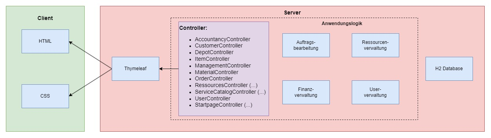
- **Client**: Beinhaltet HTML- und CSS-Dateien. Stellt die Benutzeroberfläche dar und kommuniziert mit dem Server.
- **Server**: Verwendet Thymeleaf als Template-Engine. Implementiert die Anwendungslogik mittels Spring Framework und verwaltet eine H2 Datenbank.

==== Persistenz
Um die Persistenz der Daten zu gewährleisten, wird Hibernate für das Object-Relational Mapping (ORM) und eine H2-Datenbank für die Datenspeicherung verwendet.

- *Hibernate*: ermöglicht eine einfache und transparente Persistenz von Java-Objekten in der Datenbank.
Verbindet die Objekte der Geschäftslogik mit der relationalen Datenbank.

- *H2-Datenbank*: eine schlanke, in Java implementierte relationale Datenbank, die einfach zu konfigurieren ist.
Der Vorteile der H2-Datenbank besteht außerdem in dem geringen Speicherbedarf, der unkomplizierten Konfiguration und einer schnelle Ausführung von Abfragen.

==== Frameworks
Für die Anwendungsentwicklung werden verschiedene Frameworks und Bibliotheken verwendet, um die Entwicklung zu erleichtern und die Qualität der Software zu verbessern.
Insbesondere die unten aufgeführten Frameworks werden verwendet:

- *Spring Boot*: Einfache Konfiguration und Betrieb von Spring-Anwendungen durch Konventionen und automatische Konfiguration.
- *Spring Data JPA*: Schnelle und einfache Implementierung von JPA-basierten Datenzugriffstechnologien.
- *Spring Security*: Implementierung umfassender Sicherheitsfunktionen, einschließlich Authentifizierung und Autorisierung.
- *Thymeleaf*: Serverseitige Java-Template-Engine, zur Generierung dynamischer HTML-Seiten.

=== Kontrollfluss der Nutzeroberfläche

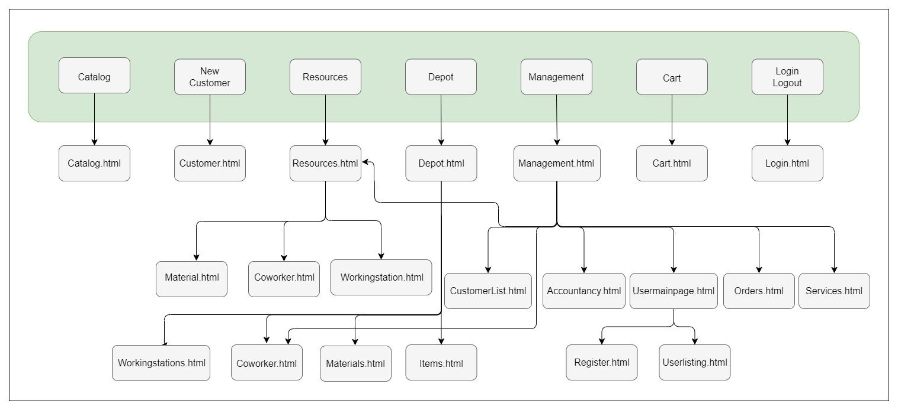

*Interaktion*: Der Nutzer interagiert mit der Benutzeroberfläche, die Anfragen an den Server sendet. Diese Interaktionen können die Eingabe von Daten, das Auslösen von Aktionen oder das Navigieren durch die Anwendung umfassen.

*Serververarbeitung*: Der Server verarbeitet die Anfragen und führt die notwendige Geschäftslogik aus. Dies kann das Speichern oder Abrufen von Daten aus der Datenbank, die Berechnung von Ergebnissen oder die Validierung von Eingaben umfassen.

*Antwort*: Der Server sendet die verarbeiteten Daten zurück an den Client. Dies geschieht in Form von HTML-Seiten, die mit Thymeleaf generiert wurden. Die Seiten enthalten die aktualisierten Daten und ermöglichen dem Nutzer die weitere Interaktion.

*Benutzeroberfläche*: Die Benutzeroberfläche aktualisiert sich basierend auf den erhaltenen Daten und stellt diese dem Nutzer zur Verfügung.

== Toplevel-Architektur

=== Systemkontext

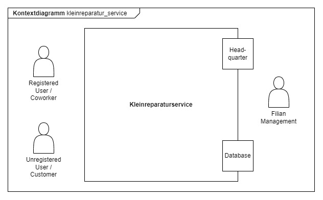

Im Rahmen des Systemkontextes interagieren Kunden (Customer), Mitarbeiter (Coworker) und das Filial-Management mit dem System.

Unregistrierte Kunden können über die Webanwendungen Informationen zu den angebotenen Dienstleistungen und zum Unternehmen abrufen.
Um für einen Kunden einen Auftrag zu erstellen, ist ein Registrierung in dem jeweiligen Standort erforderlich.
Der Kunde wird dann durch einen Mitarbeiter im System angelegt und erhält einen Benutzeraccount.
Mit diesem ist es dann möglich, Aufträge zu erstellen, einzusehen und den Gegenstand (Item) auch wieder abzuholen.

Damit die Mitarbeiter die Webanwendung nutzen können, müssen sie sich ebenfalls registriert sein.
Der Prozess der allgemeinen Mitarbeiterverwaltung ist dem Filial-Management vorbehalten.
Es legt den Mitarbeiter an, aktualisiert Mitarbeiterinformationen und löscht deren Accounts bei Entfallen des Arbeitsverhältnisses.

Das System an sich kommuniziert auf der einen Seite mit einer Datenbank zur dauerhaften Speicherung der Daten.
Auf der anderen Seite werden die montalichen Bilanzen an die Zentrale (Headquarter) übermittelt.

=== Teilkomponenten

An dieser Stelle erfolgt nun eine vollständige Aufzählung aller Komponenten, die für die Entwicklung der Webanwendung als notwendig identifiziert wurden.
Die Identifizierung erfolgt auf Basis der Anforderungen des und der Architektur des Systems.

* Accountancy: Verwaltung und Erstellung der monatlichen Bilanzen
* Customer: Repräsentation der Kunden
* Depot: Verwaltung der Warenlagerung (Erstellung, Bearbeitung, Löschung)
* Item: Repräsentation der Reparaturgegenstände
* Management: Rollengebundene Funktionen für die Verwaltung der Filiale
* Materials: Verwaltung aller für Reparaturen benötigten Materialien (Erstellung, Bearbeitung, Löschung)
* Order: Repräsenation der Aufträge - in direkter Beziehung zu Customer, Items und Service, mit Abhängigkeiten zu Accountancy
* Ressources: Bündelung der Komponenten Coworkers und WorkingStations
** Coworkers: Repräsentation der Mitarbeiter inkl. deren Verwaltung (Erstellung, Bearbeitung, Löschung)
** WorkingStations: Repräsentation der Arbeitsplätze inkl. Verwaltung (Erstellung, Bearbeitung, Löschung)
* ServiceCatalog: Repräsentation der Dienstleistungsklassen - notwendige Zuordnung von Service zu einem ServiceType
** Service: Repräsentation der Dienstleistungen inkl. Verwaltung (Erstellung, Bearbeitung, Löschung)
* Startpage: Startseite der Webanwendung
* User: Repräsentation der Benutzer inkl. deren Verwaltung (Erstellung, Bearbeitung, Löschung)

Im weiteren Verlauf der Dokumentation werden jedoch nicht alle dieser Komponenten im Detail betrachtet, sondern nur diejenigen, die für die Entwicklung der Webanwendung von besonderer Bedeutung oder besonders komplex sind.

== Detailarchitektur der Komponenten

=== Komponentenübersicht inkl. Klassen

==== User
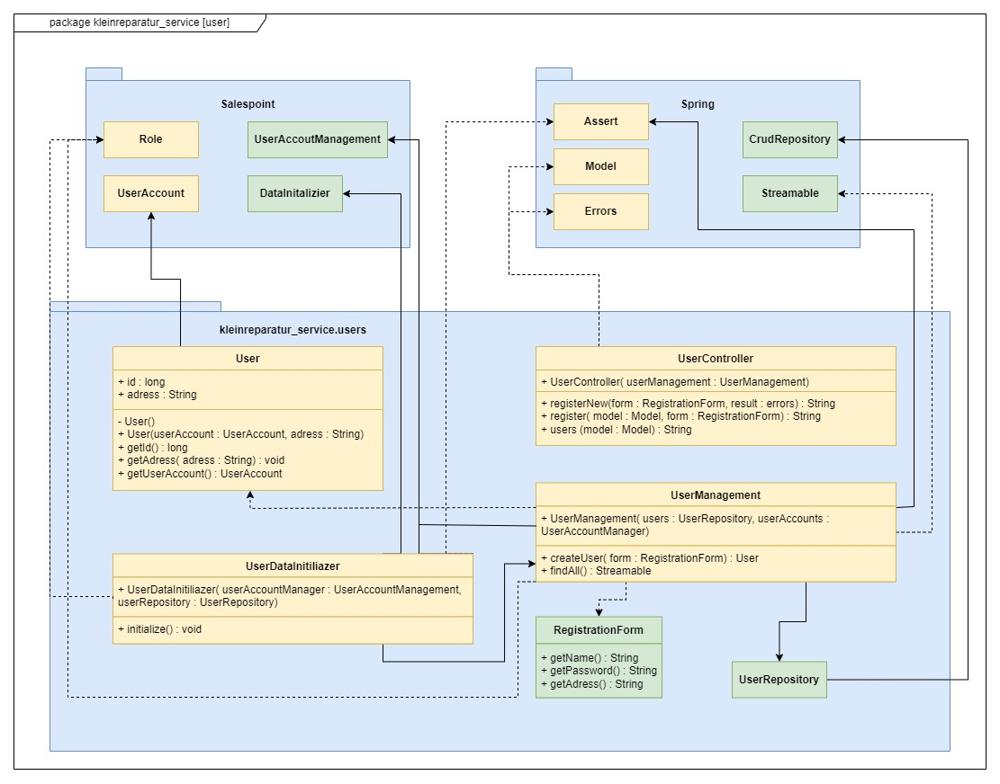

[options="header"]
|===
|Klasse |Beschreibung
|user| Klasse erweitert Salespoint-UserAccount mit zusätzlichen Eigenschaften
|UserController| Ein Spring MVC Controller behandeln von Aktionen die User betreffen 
|UserDatainitializer| Ein Datainitializer der Dummy User beim Application start erstellt
|UserManagement| Eine Klasse für das Verwalten von User
|UserRepository| Ein Repository-Interface um einzelne  User Interfaces zu behandeln und speichern
|RegistrationFrom| ein Interface um die Eingaben bei Registriegung von einem User zu prüfen
|===

==== Depot
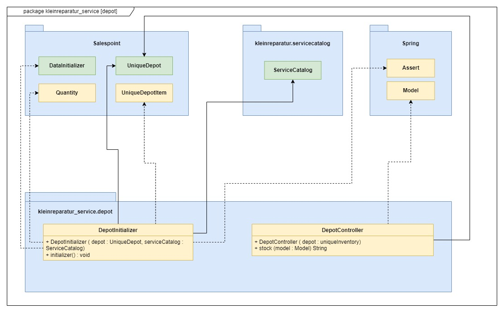

[options="header"]
|===
|Klasse |Beschreibung
|DepotController| Controller zur Verwaltung der Navigation zwischen den einzelnen Depot-Views
|===

==== Order
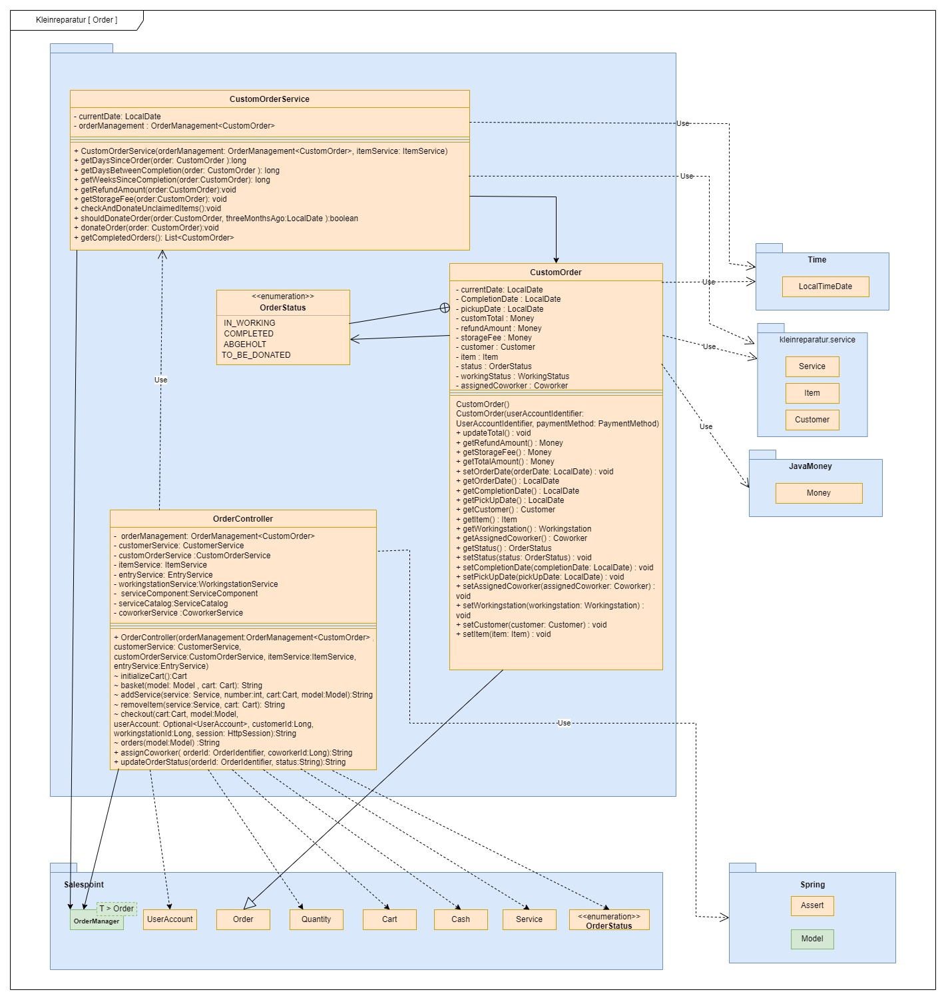

[options="header"]
|===
|Klasse |Beschreibung
|OrderController|Ein Spring MVC Controller für den Warenkorb
|CustomOrder| Klasse für die Entität Order ("Bestellung" - Erstellung von Auftragsobjekten)
|CustomOrderService| Implementierung der Geschäftslogik bzgl. der Aufträge wie bspw. Lagergebühren, etc.
|===

==== ServiceCatalog
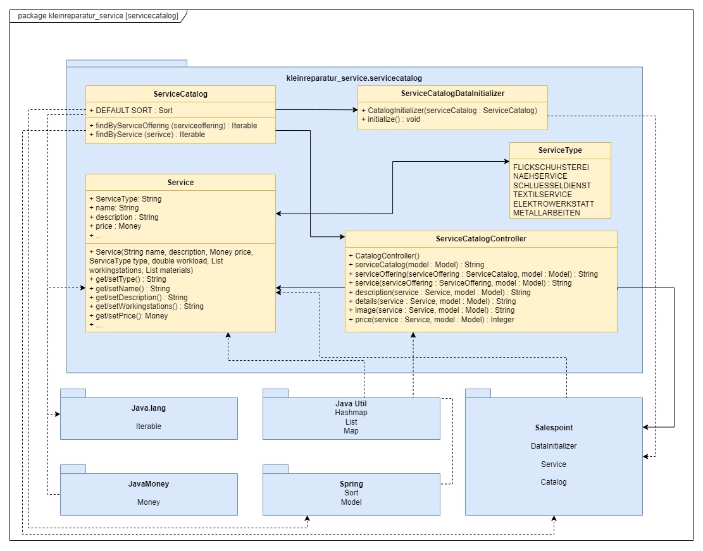

[options="header"]
|===
|Klasse |Beschreibung
|Service| Klasse für die Entität Service
|ServiceCatalog| Interface für die ServiceCatalog-Komponente
|ServiceCatalogController| Controller zur Verwaltung der Navigation
|ServiceCatalogDataInitializier| Initialisierung der ServiceCatalog-Komponente
|ServiceComponent| Erweiterung der Service-Klasse um für den Service benöitgtes Material und WorkingStation
|ServiceController| Controller zur Verwaltung der Navigation
|ServiceMaterial | Erweiterung der Material-Klasse um für den Service benötigtes Material
|ServiceRepository| JPA-Repository Interface für die Service-Klasse
|===

==== Customer
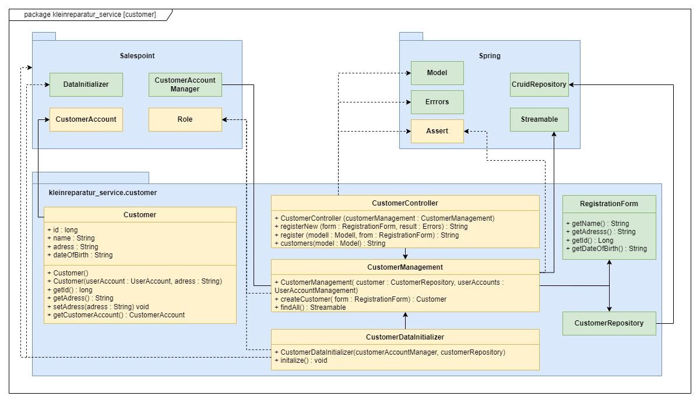

[options="header"]
|===
|Klasse |Beschreibung
|Customer| Klasse für die Entität Customer
|CustomerController| Controller zur Verwaltung der Navigation
|CustomerRepository| JPA-Repository Interface für die Customer-Klasse
|CustomerService| Implementierung der Geschäftslogik bzgl. Kunden
|===

=== Laufzeitsicht
Darstellung der Komponenteninteraktion anhand eines Sequenzdiagramms, welches die relevantesten Interaktionen darstellt.

==== User
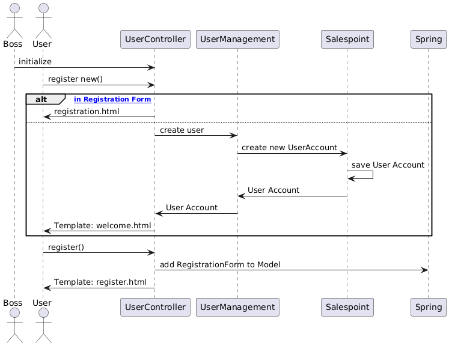

==== Depot
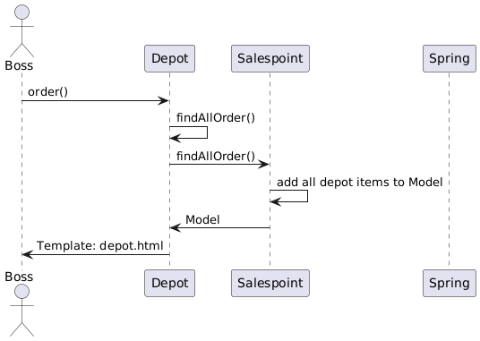

==== Order
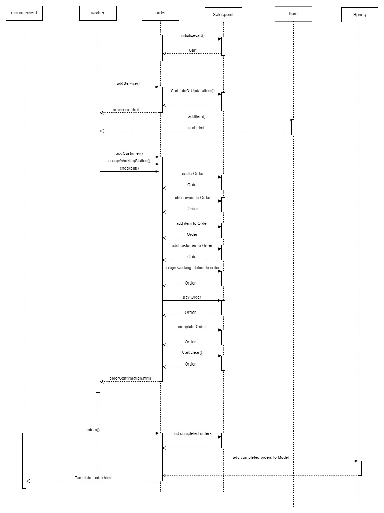

==== Service
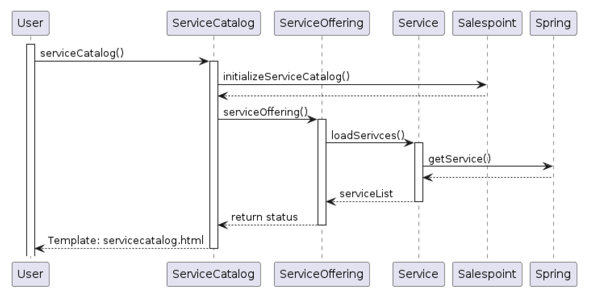

==== Customer
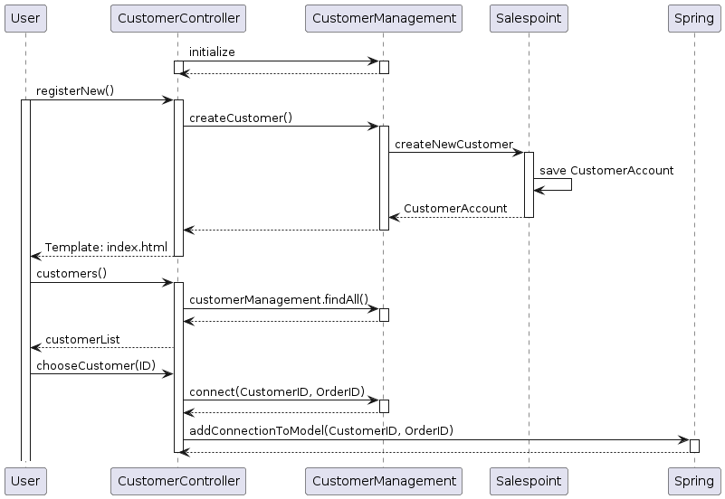

== Verwendungsgrad der Element des Analysemodells
Im Analysemodell wurden Anforderungen, Komponenten und Zusammenhänge nicht ausreichend detailliert bzw. spezifiziert, sodass im Rahmen der Erstellung der Entwicklerdokumentation
erheblicher Mehraufwand entstanden ist, diese und weitere Details, sowie Komponenten und Klassen zu identifizieren und zu beschreiben.
Die grundlegende Struktur sowie die Anforderungen und Use-Cases des Analysemodells konnte jedoch beibehalten werden und diente als Grundlage für die Erstellung der Entwicklerdokumentation.

== Testvorgehen und -ergebnisse
Im Rahmen des Softwareprojekts wurden Unit-Tests für zufällige Komponenten erstellt und die Komponenten soweit angepasst, dass diese ohne Fehler durchlaufen.
Konkret wurden Unit-Tests für die folgenden Komponenten erstellt:

* Customer
* Item
* Materials
* Ressources
* Startpage
* User

Da die Tests automatisiert sind, sind die Ergebnisse in einfachen Textdokumenten festgehalten und können bei Bedarf unter Documents eingesehen werden.

Neben den Unit-Tests wurde im Rahmen des Crosstestings die gesamte Anwendung auf Funktionalität und Usability getestet.
Da das System zum Zeitpunkt der Durchführung nicht stabil war, wurde eine Vielzahl von Fehlern und Mängeln festgestellt, die im weiteren Verlauf des Projekts behoben worden sind.
Im Zusammenhang mit der Aufarbeitung der Ergebnisse des Crosstestings, wurde intern immer wieder die Kernfunktionalitäten der Anwendung durch UI-Tests überprüft
und mithilfe der Ergebnisse weiter verbessert.

Zum jetzigen Stand ist die Anwendung soweit stabil und funktional, dass sie die Geschäftsprozesse der Miss Mint Mending Points GmbH abbildet und unterstützt.