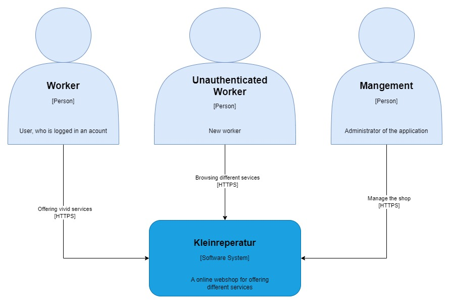

= Entwicklerdokumentation
:project_name: Kleinreperaturen
:company_name: Miss Mint Mending Points
[options="header"]
[cols="1, 3, 3"]
|===
|Version | Bearbeitungsdatum   | Autor 
|1.0	|11.05.2024| Pritkumar Dobariya
|1.1  |12.05.2024| Vihar Kheni
|===

== Einführung und Ziele
=== Einführung
Mit {company_name} drängt eine neue Kette von Kleinreparaturbetrieben auf den Markt, die sich nach dem Slogan: "Alles aus einer Hand" durch ein besonders umfassendes Dienstleistungsangebot etablieren möchte. Jeder Miss-Mint-Reparaturbetrieb umfasst:

* eine Flickschusterei (Absätze, Sohlen, Nähte)
* einen Nähservice (Knöpfe, Nähte, Flicken)
* einen Schlüsseldienst (Schlüssel kopieren, Schilder gravieren)
* eine Schnellreinigung und Heißmangel (Wäsche, Anzüge, Leder)
* eine Elektrowerkstatt (Kabel ersetzen, löten)
* eine Scherenschleiferei (Scheren, Messer schärfen)

Laut Geschäftsordnung der {company_name} wird an den Annahmeschaltern der Preis einer gewünschten Dienstleistung sofort ermittelt und vom Kunden im Voraus bezahlt. Der Kunde erhält einen Auftragszettel mit einer eindeutigen Auftragsnummer und dem Fertigstellungstermin. Ab dem Fertigstellungstermin kann die Ware eine Woche lang unter Vorlage des Auftragszettels abgeholt werden. Danach wandert die Ware für drei Monate in eine Aufbewahrungsstelle, wo sie unter Vorlage des Auftragszettels durch Zahlung der Aufbewahrungsgebühr von 1,50 € pro Woche ausgelöst werden kann. Waren, die auch in diesem Zeitraum nicht abgeholt werden, fallen an eine karitative Organisation. Umgekehrt erstattet Miss Mint für jeden vollen Tag, um den sich die Erbringung der Dienstleistung verspätet, 10 Prozent der Reparaturkosten zurück.
Das Miss-Mint-Filialmanagement kümmert sich um die Bereitstellung der Ressourcen (Personal, Arbeitsgerät, Material, Räume) und führt monatlich den Reingewinn (nach Abzug der laufenden Kosten) an die Zentrale ab.
Die Miss-Mint-Kette ist an Software interessiert, welche die Annahme, Reparaturplanung, Ausgabe und Lagerung der Waren sowie die Verwaltung der Ressourcen unterstützt und außerdem dem Filialmanagement laufende und akkumulierte Bilanzen zur Verfügung stellt.

=== Qualitätsziele

== Randbedingungen
=== Hardware-Spezifikationen
Eine Liste der notwendigen Geräte / Hardware, um die Anwendung auszuführen und zu verwenden.

* Server
* Computer
* Tastatur
* Maus

=== Software-Spezifikationen
Eine Liste der notwendigen Software, um die Anwendung auszuführen und zu verwenden.

Die folgende (oder neuere) Java-Version ist erforderlich, um die Anwendung auszuführen:

* Java 17

Die folgenden (oder neuere) Browser-Versionen sind erforderlich, um die Anwendung zu verwenden:

* Internet Explorer / Edge 10.0
* Firefox 4.0
* Google Chrome 4.0
* Opera 9.6

=== Vorgaben zum Betrieb des Software
Dieser Abschnitt gibt einen Überblick darüber, wie das Produkt nach Abschluss verwendet werden soll und unter welchen Umständen.

Das System wird von der {company_name} als Webshop verwendet, um Dienstleistungsangebot (Service) an Kunden zu verkaufen.
Die Software soll auf einem Server ausgeführt und über das Internet (über einen Browser) für interessierte Kunden rund um die Uhr verfügbar sein.

Die Hauptbenutzer der Software sind Mitarberiter (Worker), die angeblich typische Website-Navigationsmuster kennen, sowie Administratoren (Managemaent), die nicht unbedingt über technische Kenntnisse verfügen.

Das System soll keine technische Wartung benötigen, da das Personal der {company_name} bereits ausgelastet ist.
Alle Daten sollen dauerhaft in einer Datenbank gespeichert und über die Anwendung zugänglich sein (z. B. sollte für einen Boss kein SQL-Wissen erforderlich sein).

== Kontextabgrenzung
=== Kontextdiagramm

[[context_diagram_d_c4]]

== Lösungsstrategie
=== Erfüllung der Qualitätsziele
[options="header"]
|=== 
|Qualitätsziel |Lösungsansatz
|... |...
|===

=== Softwarearchitektur

[[client_server_diagram]]

image::./models/client_server.jpg[context diagram c4, 100%, 100%, pdfwidth=100%, title= "Client Server Model of the application. The client only contains HTML and CSS files. The application logic is implemented on the server", align=center]

*Erklärung:* HTML-Vorlagen werden auf dem Server gerendert und vom Client mit ihren entsprechenden CSS-Stylesheets angezeigt. Die in den Vorlagen angezeigten Daten werden von Thymeleaf bereitgestellt. Thymeleaf empfängt die angeforderten Daten durch die Controller-Klassen, die im Backend implementiert sind. Diese Controller-Klassen verwenden wiederum Instanzen und Methoden der Model-Klassen. Standardmäßig speichert eine zugrunde liegende H2-Datenbank Daten dauerhaft.

=== Entwurfsentscheidungen
==== Entwurfsmuster
* Spring MVC

==== Persistenz
Die Anwendung verwendet *Hibernate annotation based mapping*, um Java-Klassen auf Datenbanktabellen abzubilden. Als Datenbank wird *H2* verwendet.

Die Persistenz ist standardmäßig ausgeschaltet. Um die Persistenzspeicherung zu aktivieren, müssen die folgenden zwei Zeilen in der Datei _application.properties_ auskommentiert werden:
....
# spring.datasource.url=jdbc:h2:./db/videoshop
# spring.jpa.hibernate.ddl-auto=update
....

==== Benutzeroberfläche
[[user-interface]]
image::./models/UI Diagram.png[context diagram c4, 100%, 100%, pdfwidth=100%, title= "Dialog Map of the Kleinreparatur Service", align=center]

NOTE: Die grüne Kästen zeigen ein HTML-Template an. Die weißen Kästchen innerhalb der Vorlagen stellen Schaltflächen dar, die zu den Vorlagen weiterleiten, deren ausgehende Pfeile auf._ zeigen.

* Verwendung externer Frameworks

[options="header", cols="1,2,3"]
|===
|Externes Package |Verwendet von |Warum
|Spring Boot|General purpose|…
|Spring Data JPA|Persistence|…
|Spring Security|Security|…
|Semantic UI|UI|…
|jQuery|UI|…
|===

== Bausteinsicht
* Package-Diagramm
* Entwurfsklassendiagramme der einzelnen Packages

[options="header"]
|=== 
|Klasse/Enumeration |Description
|... |...
|===

=== Rückverfolgbarkeit zwischen Analyse- und Entwurfsmodell
_Die folgende Tabelle zeigt die Rückverfolgbarkeit zwischen Entwurfs- und Analysemodell._

[options="header"]
|===
|Klasse/Enumeration (Analysemodell) |Klasse/Enumeration (Entwurfsmodell)
|... |...
|===

== Laufzeitsicht
* Darstellung der Komponenteninteraktion anhand eines Sequenzdiagramms, welches die relevantesten Interaktionen darstellt.

