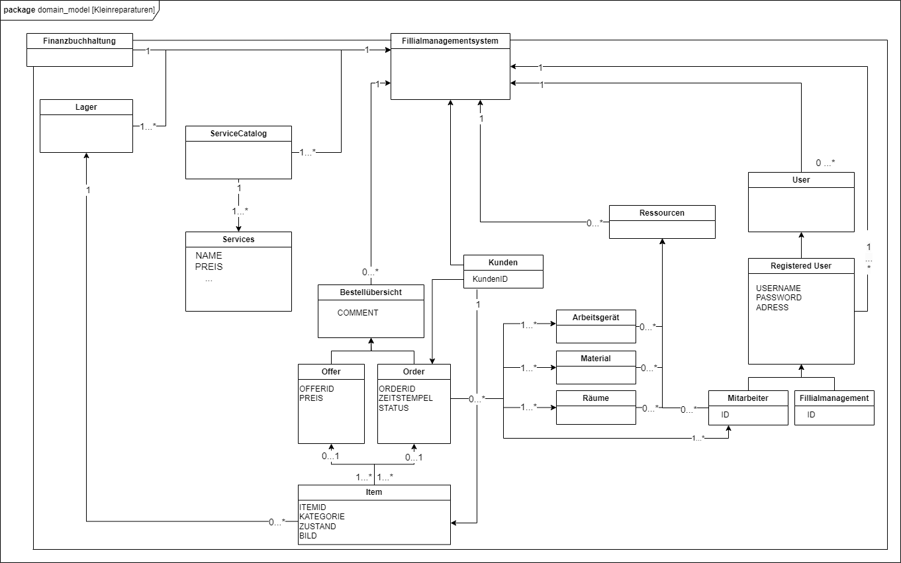

= Pflichtenheft
[[Pflichtenheft]]
:project_name: Kleinreparaturen-System
== __{Kleinreparaturen-System}__

[options="header"]
[cols="1, 1, 1, 1, 4"]
|===
|Version | Status      | Bearbeitungsdatum   | Autoren(en) |  Vermerk
|0.1     | In Arbeit   | 21.04.24          | Pascal       | Initiale Version
|===

== Use-Cases
[[Use-Cases]]

Im folgenden Abschnitt werden die notwendigen Anwendungsfälle, die das System zu unterstützen hat, dokumentiert. Die Anwendungsfälle definieren alle essentiellen Funktionen, die das System den Nutzern zu Verfügung stellen können soll.

=== Actors
[[Actors]]

In Form einer Tabelle ist jeder Actor, also Personen, die mit dem System direkt oder indirekt durch andere Services interagieren, aufgelistet. Zu jedem Actor wird eine Beschreibung beigefügt. Falls ein Actor keine spezifische Person, sondern eine Gruppe von Personen oder eine Verallgemeinerung anderer Actors, beschreibt, werden diese *abstract Actors* mittels *Kursiv* Schrift verdeutlicht.

[options="header", cols="1,1"]
|===
| Name 
| Description

| *User* 
|  Beschreibt jede authentifizierte und unauthentifizierte Person , welche mit dem System interagiert

| *Registered User* 
| Alle *User*, die im System registriert sind und sich authentifiziert haben und mit dem System interagieren

| *Unauthenticated User* 
| Alle *User*, die nicht authentifiziert sind oder nicht im System registriert sind und mit dem System interagieren

| *Customer* 
| Alle *User*, die unauthentifiziert sind und per QR-Code des Bestelltickets auf das System zugreifen. Können Bestellfortschritt einsehen

| *Worker* 
| Alle *User* die als Filialmitarbeiter registriert sind und Bestellungen von Kunden annehmen, bearbeiten und abschließen können

| *Management* 
| Ein *User* welchen als Filialleiter registriert ist und administratorrechte über das System hat
|===

=== Use-Case Diagram
[[Use-Case-Diagram]]

image::models/Use-Case-Diagram.jpg[]
Figure 1. Use-Case Diagramm des Kleinreparaturen-Systems in UML

=== Use-Case Description
[[Use-Case-Description]]

In Form einer Tabelle ist jeder Use-Case aus dem oben aufgezeigten Use-Case Diagramm detailliert aufgelistet und definiert.

|===
| ID | ID000
| Name | Geschäftsprozess
| Description | Der Benutzer kann das System öffnen und somit jeglichen beschriebenen Prozess starten
| Actors | User
| Trigger | .exe des Systems wird auf individuellem Client gestartet
| Precondition(s) | das System muss auf dem Server online und durch das Netzwerk erreichbar sein
| Essential Steps | User ist mit seiner Client Maschine in einem Netzwerk, was das System erreichen kann und startet mit einem Doppelklick die .exe Anwendung
| Functional Requirements | User ist in lokalen Netzwerk des Systems und hat eine aktuelle Version der Anwendung auf dem Client-System
|===

|===
| ID | ID001
| Name | Login / Logout
| Description | Der Benutzer kann sich authentifizieren, anmelden und abmelden.
| Actors | User
| Trigger a| 
Login : Ein Benutzer kann auf Funktionen zugreifen, indem er sich anmeldet 
Logout : Nach Nutzung der Funktionen kann der Benutzer die Webseite verlassen indem er sich abmeldet
| Precondition(s) a| 
Login : Noch nicht authentifiziert 
Logout : Der Benutzer ist authentifiziert
| Essential Steps a| 
1. Login:  
- Der Benutzer kann sich über die Navigationsleiste anmelden 
- Der Benutzer kann ein ID-Passwort eingeben 
- Der Benutzer kann die Anmeldeschaltfläche drücken
- Der Benutzer kann die Funktion „Passwort vergessen“ nutzen 
2. Logout: 
- Der Benutzer kann sich von der Navigationsleiste abmelden
- Der Benutzer kann sich abmelden und zur Startseite wechseln
| Functional Requirements | Anwendung wurde erfolgreich gestartet
|===

|===
| ID | ID002
| Name | Passwortwiederherstellung
| Description | kann ein neues Passwort für einen spezifischen User, der im System bereits Registriert ist, anfordern
| Actors | registered User
| Trigger | auf dem Anmeldebildschirm wird auf den Button "Passwortwiederherstellung geklickt"
| Precondition(s) | das Passwort wurde vergessen und der User ist bereits im System registriert
| Essential Steps a| 
1. Auf das Fenster Passwortwiederherstellung" Doppelklick machen 
2. Username eingeben und für diesem User ein neues Passwort beim Systemanfordern (Anfrage an das Filialmanagement zu Autorisierung)
| Extentions | bei vorhandener E-Mail kann einer Mail zur Autorisierung versendet werden und darüber das Passwort zurückgesetzt werden
| Functional Requirements | User ist ein Registered User und kann auf den Login/Logout Bildschirm zugreifen
|===

|===
| ID | ID002
| Name | Mitarbeiterregistrierung
| Description | Ein Management muss in der Lage sein, ein Konto für neue Mitarbeiter zu erstellen
| Actors | Filialmanagement
| Trigger | Ein Filialleiter möchte ein Konto für einen neuen Mitarbeiter erstellen, indem er auf „Registrierung“ klickt
| Precondition(s) | Der Benutzer ist noch nicht angemeldet
| Essential Steps a| 
1. Die Filialleitung drückt auf Registrierung 
2. Es fügt Rolle, Username und Passwort hinzu 
3. Systemprüfung auf eindeutigen Benutzernamen bei Generierung eines neuen Kontos 
4. im Fall von Duplikaten wird eine Fehlermeldung ausgegeben
| Functional Requirements | User mit der Rolle "Filialmanagement" muss authenticated sein und Daten für einen neuen User haben
|===

|===
| ID | ID003
| Name | Bestellübersicht
| Description | Der Kunde kann mehrere Dienste hinzufügen, diese anzeigen lassen und als neue Bestellung aufgeben
| Actors | Worker
| Trigger | Zugriff auf die Funktion „Angebot erstellen“, "Angebot verwalten", "Bestellung verwalten" mittels Doppelklick der jeweiligen Buttons im Menü
| Precondition(s) | Menge und Beschreibung des Services muss vervollständigt sein und User muss als Worker registriert und authentifiziert sein
| Essential Steps a| 
1. Auf der Produktserviceseite kann der Benutzer einen Service zum Warenkorb hinzufügen 
2. Dem Benutzer werden alle ausgewählten Services im Warenkorb mit einem automatisch errechneten Gesamtpreis dargestellt 
3. Der Benutzer kann das Angebot aufgeben indem er den Warenkorb abschließt 
4. Ein Angebot kann bei geleisteter Vorauszahlung zu einer Bestellung umgewandelt werden und diese in ihrem Status verwaltet werden 
| Extentions | zusätzliche Informationen über den Bestellstatus und anfallenden zusätzliche Kosten dem Kunden mittels QR Code übermitteln
| Functional Requirements | einen Worker der auf dem Aktiven System agieren kann, sowie die nötigen Kundeninformationen für Angebote und Bestellungen
|===

|===
| ID | ID013
| Name | Kundenverwaltung
| Description | anlegen und verwalten von Kunden und deren Informationen
| Actors | Worker
| Trigger | ein neuer Kunde schließt eine Bestellung ab
| Precondition(s) | Kunde hatte zuvor noch nie eine Dienstleistung in der Filiale in Anspruch genommen
| Essential Steps | Doppelklick auf das Fenster "neuen Kunden anlegen" innerhalb der Bestellübersicht
| Functional Requirements | Kundendaten müssen vorhanden sein und Worker muss authentifiziert sein
|===

|===
| ID | ID023
| Name | Bestellverwaltung
| Description | Menü zur Verwaltung von Angeboten und Bestellungen
| Actors | Worker
| Trigger | Worker wählt im Hauptmenü die "Bestellübersicht" mittels Doppelklick aus
| Precondition(s) | Worker ist im System authentifiziert
| Essential Steps a| 
1. Worker wählt im Hauptmenü "Bestellübersicht aus" 
2. Worker kann nun im Menü auswählen ob er neues Angebot erstellen will, bestehende Angebote verwalten will oder bestehende Bestellungen verwalten will
3. bestehende Angebote und Bestellungen würde per Listen aufgeführt
| Functional Requirements | bestehende Angebote und Bestellungen müssen korrekt angelegt sein, der Worker muss authentifiziert
|===

|===
| ID | ID033
| Name | Check-Out
| Description | Abschließen einer Bestellung, indem Kunde den reparierten Gegenstand abholt
| Actors | Worker
| Trigger | Kunde kommt in Filiale und holt Gegenstand ab, Worker vermerkt das im System
| Precondition(s) | Bestellung muss angelegt und noch offen und mit dem Status abholbereit sein
| Essential Steps a| 
1. Bestellung wird auf den Status abholbereit gesetzt
2. Kunde kommt in Filiale und begleicht offene Beträge, wie Lagerkosten bei Überschreitung der Lagerzeit, oder bekommt Vergünstigung bei Überzug der Bearbeitungszeit durch die Filiale
3. Worker schließt Bestellung ab und verschiebt Bestellung in Archiv und trägt Gegenstand aus dem Lager aus
| Functional Requirements | Bestellung und Gegenstand müssen angelegt und vorhanden sein, Gegenstand muss repariert sein
|===

|===
| ID | ID004
| Name | Serviceverwaltung
| Description a| 
Alle Mitarbeiter müssen auf den Katalog zugreifen können 
Es werden alle angebotenen Dienste gezeigt 
Der Servicekatalog bietet die Möglichkeit zwischen verschiedenen Arten von Services zu unterscheiden
| Actors | Worker
| Trigger | Verwenden eines Navigationselements, das für die Anzeige des Servicekatalogs verantwortlich ist
| Precondition(s) | Services müssen korrekt eingearbeitet sein, Worker muss einen Service ändern wollen
| Essential Steps a| 
Mitarbeiter klicken auf das Navigationselement (Leistungsliste) 
Dem Benutzer werden alle Dienste der ausgewählten Kategorie angezeigt
| Functional Requirements | Worker muss authentifiziert sein und auf das System zugreifen können
|===

|===
| ID | ID005
| Name | Ressourcenverwaltung
| Description | Anlegen und Verwaltung von Ressourcen einer Filiale
| Actors | Filialmanagement
| Trigger | Manager geht mittels Doppelklick des Fensters "Ressourcenverwaltung" im Hauptmenü in die Ressourcenverwaltung
| Precondition(s) | Manager ist authentifiziert und registriert
| Essential Steps a| 
1. Manager klickt auf das Fenster im Hauptmenü
2. Manager kann nun aus Listen von angelegten Ressourcen auswählen und einzelne Ressourcen verwalten oder neu hinzufügen
| Functional Requirements | existierende Ressourcen müssen korrekt im System angelegt sein
|===

|===
| ID | ID006
| Name | Spende
| Description | spenden eines Gegenstandes bei Überschreitung einer Lagerfrist von 3 Monaten
| Actors | Worker
| Trigger | vorhandener Gegenstand überschreitet Lagerfrist von 3 Monaten gerechnet ab Ablauf der Abholfrist in der Filiale von einer Woche
| Precondition(s) | Gegenstand und dazugehörige Bestellung muss angelegt sein, Zeitstempel des Gegenstandes muss korrekt geführt sein
| Essential Steps a|
1. Gegenstand überschreitet Lagerfrist
2. Worker nimmt den Gegenstand, trägt ihn aus dem Lager aus und überträgt diesen im System an einen Organisation
3. Gegenstand wird an Organisation versendet
| Functional Requirements | Zeitstempel der Einlagerung des Gegenstandes liegt drei Monate zurück
|===

|===
| ID | ID007
| Name | Bilanzerstellung
| Description | automatisch generierte Finanz-Übersicht aus laufenden, abgeschlossenen Bestellungen und laufenden/ variablen Kosten einer Filiale
| Actors | Filialmanagement
| Trigger | fortlaufend automatisierter Prozess für anfallende Kosten oder Einnahmen
| Precondition(s) | das System muss online sein und alle Kosten und Beträge von Bestellungen müssen korrekt eingetragen sein
| Essential Steps | Kosten oder Einnahmen werden durch Bestellungen von Ressourcen, anfallen laufender Kosten oder das Abschließen von Bestellungen im System gespeichert und automatisch vom System in die Finanz-Übersicht eingearbeitet
| Functional Requirements | Kostenfunktionen, sowie Daten über laufende und variable Kosten und Einnahmen müssen vorhanden sein
|===

|===
| ID | ID008
| Name | Materialbestellung
| Description | Eintragen von Bestellung von Ressourcen in das System
| Actors | Filialmanagement
| Trigger | ein Manager bestellt neue Ressourcen und dokumentiert die anfallenden Kosten und neue Ressourcen im System
| Precondition(s) | bestellte Ressource muss beschaffbar und im System angelegt sein
| Essential Steps a| 
1. Manager bemerkt dass Ressourcen fehlen und bestellt werden müssen
2. Bestellt bei Lieferant die Ressource
3. Manager legt die Bestellung bei Lieferant in der Materialbestellung Overlay an und trägt anfallende Kosten ein
| Functional Requirements | Ressourcen müssen im System angelegt sein, Manager muss authentifiziert sein
|===

== Data-Model
[[Data-Model]]

=== Datenmodell
[[Datenmodell]]

Figure 2. Datenmodell des Kleinreparaturen-Systems in UML

=== Daten-/ Klassenbeschreibung
[[Daten-Klassenbeschreibung]]

Folgende Tabelle stellt eine eindeutige Übersicht aller Klassen/Enums auf, die Verwendung in dem domain model finden. Die Tabelle ist Teil der Dokumentation und dient der Information der Stakeholder über Zentrale Begriffe und Konzepte des Aufbau des Systems.

[options="header", cols="1,1"]
|===
| Enumerations | Description
| Filialmanagementsystem | Hauptklasse des Systems, welches eine reale Kleinreparaturen Filiale beschreibt
| Finanzbuchhaltung | Repräsentation eines Buchungssystems mit automatisierten Einfangprozessen und Übersichterstellung
| Lager | Repräsentation eines Verzeichnisses an in System gespeicherten Items
| Item | Repräsentation eines zur Reparatur abgegebenen Gegenstandes
| → ITEMID | Repräsentation einer Kennnummer des abgegebenen Reparaturgegenstandes
| → KATEGORIE | Repräsentation einer Zuordnung zu nötigen Services
| → ZUSTAND | Einschätzung der Reparierbarkeit in einen originalzustand
| → BILD | Repräsentation eines Fotos des physischen Gegenstandes nach der Abgabe
| Service Catalog | Repräsentation eines Verzeichnisses an im System angelegten Services
| Service | Repräsentation der angebotenen Services mittels einem Namen, Preis und einer Beschreibung möglicher Dienstleistungen
| → NAME | Kenn-Name eines im System vermerkten Services
| → PREIS | pauschaler Grundpreis eines im System vermerkten Services
| Bestellübersicht | Repräsentation der Verwaltung und Erstellung von Offer und Order
| → COMMENT | Repräsentation von Vermerkungen und Kommentaren einer Angebote und Bestellungen
| Offer | Repräsentation eines eingegangenen Angebots
| → OFFERID | Repräsentation einer Kennnummer des Angebots
| → PREIS | Repräsentation einer für den Bestellabschluss zu vorauszahlenden Summe
| Order | Repräsentation einer laufenden Bestellung nach Angebotsbestätigung
| → ORDERID | Repräsentation einer Kennnummer einer spezifischen Bestellung
| → ZEITSTEMPEL | Repräsentation eines Datums der letzten Statusänderung
| → STATUS | Repräsentation des Bearbeitungsstatus einer Bestellung eines Kunden [Open, Complete, Stored, Expired]
| Kunden | Repräsentation einer Realen Person, die Kunde, also Auftraggeber, mittels einer Bestellung bei einem Repair-Shop ist
| → KundenID | Repräsentation einer Kennnummer eines Kunden
| Ressourcen | Repräsentation von realen betriebseigenen Arbeitsmitteln
| Arbeitsgerät | Repräsentation von Werkzeugen und anderen betriebseigenen Gerätschaften, die in einer Filiale vorhanden sind
| Material | Repräsentation von physischen betriebseigenen Material, was betrieblichen Zwecken dient
| Räume | Repräsentation von physischen Orten einer Filiale, die unter betrieblicher Verwendung stehen
| User | Repräsentation einer realen Person
| Registered User | Repräsentation einer realen Person, die im System registriert ist und mittels Login sich authentifizieren können
| → USERNAME | Name einer realen Person, mit der diese im System eingetragen ist
| → PASSWORD | Passwort das eine registrierte Person in Verbindung mit dem USERNAME im Login authentifiziert
| → ADRESS | Repräsentation der Rolle und Rechten eines spezifischen Users
| Mitarbeiter | Repräsentation eines realen Mitarbeiters
| → ID | Repräsentation einer Kennnummer eines spezifischen Mitarbeiters im System
| Filialmanagement| Repräsentation einer realen Filialleitung
| → ID | Repräsentation einer Kennnummer eines spezifischen Filialmanagements im System
