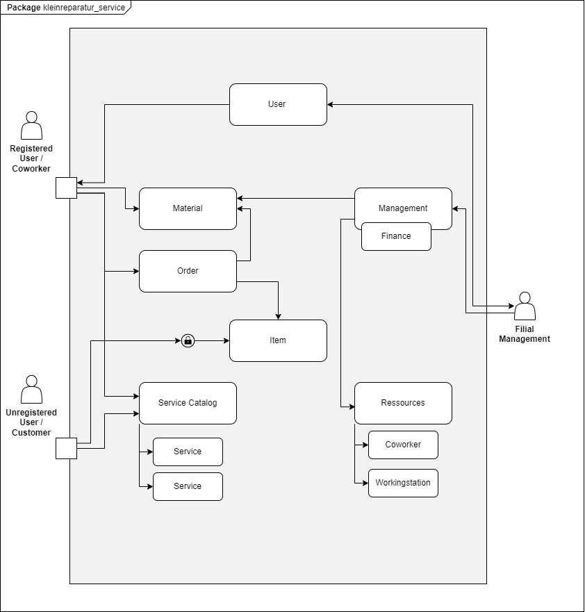

= Pflichtenheft
:project_name: Kleinreparaturen
:toc: left
:toc-title: Inhaltsverzeichnis
:numbered:

[[Pflichtenheft]]
:project_name: Kleinreparaturen-System

[options="header"]
[cols="1, 1, 1, 1, 4"]
|===
|Version | Status       | Bearbeitungsdatum   | Autoren(en)     |  Vermerk
| 1.0    | abgeschlossen| 21.04.2024          | Jannes Schöttke | Initiale Version außerhalb Asciidoc
| 1.2    | abgeschlossen| 29.04.2024            | Philipp Danzmann     | Feinschliff
| 1.3    | abgeschlossen| 28.04.2024            | Pascal Jahn     | Englische Version updated
| 1.4    | abgeschlossen| 30.04.2024            | Vihar Kheni     | GUI V2 , Englisch Systemkontextdiagramm
| 2.0    | abgeschlossen | 10.06.2024          | Jannes Schöttke | Überarbeitung und Vereinheitlichung der Dokumentation
| 3.0    | abgeschlossen | 27.07.2024          | Pascal Jahn | Finalisierung für Abgabe
|===

toc::[]

== Zusammenfassung
[[Zusammenfassung]]

Das vorliegende Pflichtenheft definiert die Anforderungen und Ziele für die Entwicklung der geplanten Software. Es legt den Umfang der geplanten Software fest. Darüber hinaus werden die Anforderungen an die Benutzerinteraktion sowie die technischen Spezifikationen detailliert beschrieben. Das Pflichtenheft dient als Grundlage für das gesamte Softwareentwicklungsprojekt und dient als Referenzpunkt für die Entwicklung, Qualitätssicherung und Abnahme.

== Aufgabenstellung
[[Aufgabenstellung]]

Der Auftraggeber, die Miss-Mint-Kette, ist an einen Softwaresystem interessiert, welches die Annahme, Reparaturplanung, Ausgabe und Lagerung von Waren sowie die Verwaltung von Ressourcen (Personal, Material, Arbeitsplätzen) unterstützt und außerdem dem Filialmanagement laufende und akkumulierte Bilanzen zur Verfügung stellt.

Das Ziel dieses Projekts ist die Entwicklung einer umfassenden Softwarelösung für die Verwaltung von Kleinreparaturbetrieben im Rahmen der Miss Mint Mending Points Kette.
Die Software soll alle Aspekte des Betriebs unterstützen, angefangen von der Erstellung und Annahme von Aufträgen über die Reparaturplanung bis hin zur Ausgabe und Lagerung. Darüber hinaus soll sie das Filialmanagement bei der Ressourcenverwaltung unterstützen und Bilanzen liefern können.

Konkret sollen folgende Funktionen umgesetzt werden:

1. **Annahme und Abwicklung von Aufträgen:** Die Software soll es ermöglichen, Kundenanfragen entgegenzunehmen, den gewünschten Service zu erfassen und den Preis sofort zu ermitteln. Nach Zahlungseingang erhält der Kunde eine Auftragsbestätigung mit einer eindeutigen Auftragsnummer und dem Fertigstellungstermin.
2. **Reparaturplanung und -ausführung:** Die Software soll die Ressourcenplanung für die verschiedenen Services unterstützen und die Zuweisung von Personal und Arbeitsplätzen ermöglichen.
3. **Lagerverwaltung:** Die Software soll die Lagerung der Waren und die Verwaltung von Aufbewahrungszeiträumen sowie Gebühren unterstützen. Nicht abgeholte Waren sollen automatisch als "Zum Spenden bereit" gekennzeichnet werden und dann in Verantwortlichkeit des Filialmanagements an eine karitative Organisation gespendet werden.
4. **Ressourcenmanagement:** Die Software soll dem Filialmanagement bei der Verwaltung von Personal, Arbeitsplätzen und Material helfen.
5. **Berichterstattung und Bilanzierung:** Die Software soll dem Filialmanagement laufende und akkumulierte Bilanzen zur Verfügung stellen, um eine effektive Geschäftsplanung und -analyse zu ermöglichen.

Zusammenfassend soll die zu entwickelnde Softwarelösung  eine effiziente Betriebsführung ermöglichen, Arbeitsabläufe optimieren und die Kundenzufriedenheit steigern.

== Produktverwendung
[[Produktverwendung]]

Die Softwarelösung, die im Rahmen dieses Projekts entwickelt werden soll, wird in Kleinreparaturbetrieben innerhalb der Miss Mint Mending Points Kette eingesetzt werden.
Diese Betriebe bieten eine Vielzahl von Services an, von der Schuhreparatur bis zur Elektrowerkstatt. Das Hauptziel der Software ist es, die täglichen Abläufe dieser Betriebe digital zu erfassen und dem Management Funktionen zur effizienten Verwaltung von Ressourcen und der Filliale und der Geschäftsplanung zu verfügung zu stellen.

**Kontext und Rahmenbedingungen:**

- **Nutzungskontext:** Die Software wird von den Mitarbeitern der Miss Mint Mending Points-Filialen in allen Aspekte des operativen Betriebs genutzt werden. Zudem sind exklusive Funktionen für das Filialmanagement vorgesehen, wie bspw. die Ressourcenverwaltung (anlegen, ändern, löschen) und Geschäftsanalyse (Kosten-Leistungsrechnung).
- **Rahmenbedingungen:** Die Nutzung der Software erfolgt in einer typischen Kleinreparaturbetriebsumgebung, in der Mitarbeiter täglich mit Kundeninteraktionen, Reparaturaufträgen und Lagerverwaltungsaufgaben konfrontiert sind. Die Software muss daher benutzerfreundlich, schnell und zuverlässig sein, um den reibungslosen Ablauf der Geschäftsprozesse sicherzustellen.

Die entwickelte Softwarelösung wird integraler Bestandteil des täglichen Betriebs der Miss Mint Mending Points-Filialen sein und soll dazu beitragen, die Effizienz zu steigern und die Qualität der Services für die Kunden zu verbessern.

== Stakeholders
[[Stakeholders]]

Im diesem Abschnitt erfolgt eine Auflistung aller von dem Projekt betroffene Interessengruppen sowie deren Einfluss auf die Anforderungen des Systems.
Die folgende Tabelle stellt neben den Namen der Gruppen und einer groben Beschreibung dieser, auch deren Priorisierung und mit dem Projekt verbundenen Zielen dar.
Die Priorisierung erfolgt auf einer Skala von 1 - niedrigste Priorität - bis 5 - höchste Priorität.

[options="header", cols="1,1,1,1"]
|===
| Name
| Priorität (1…5)
| Beschreibung
| Ziele

| Headquarter
| 3
| Der Hauptauftraggeber - formaler Vertragspartner - gibt grundlegende Anforderungen (im Rahmen des Projektauftrags) vor
a|
- Digitalisierung der Geschäftsprozesse
- Vereinheitlichung verwendeter SW
- Automatisierte Berichterstellung
- Erfüllung gesetzl. Vorschriften
- Kostenreduzierung bei Fillialverwaltung

| Filial Management
| 4
| Mitanwender des Softwaresystems - führt geschäftlich-administrative Aufgaben durch
a|
- Digitale Verwaltung der Filiale
- Vereinfachung der Geschäftsprozesse 
- Verbesserung von Transparenz und Übersichtlichkeit

| Coworker
| 5
a| Hauptanwender des Softwaresystems - wenig IT-Kenntnisse anzunehmen
a| - Reduzierung Dokumentationstätigkeiten
- Vereinheitlichung der Geschäftsprozesse
- UX-freundliches und intuitives System

| Customer
| 2
| Kunden der Miss Mint Mending Points Fillialen - kein Kontakt zum System an sich vorgesehen
a|
- Schneller & befriedigender Service
- Keine negativen Vorfälle während der Auftragsabwicklung
- Ganzheitlicher Service (Beratung, Durchführung, Wartung)
- Zuvorkommende Service-Erfahrung

|===

== Systemgrenzen und Komponentenstruktur
[[SystemgrenzenundKomponentenstruktur]]

=== Systemkontextdiagramm
[[Systemkontextdiagramm]]

Figure 1.  Systekontextdiagramm des Kleinreparaturen-Systems in UML

_Legende:_

* Personas mit Bezug zum System inkl. Rollendifferenzierung
* Quadrate zur Darstellung von Umsystemen

Die Darstellung des Headquarters im Diagramm stellt die Verbindung zum Übertragen der Geschäftszahlen dar.
Da im Projektauftrag die Art der Verbindung nicht weiter thematisiert bzw. konkretisiert ist, wird dieses Umsystem hier nur der Vollständigkeit halber mit aufgeführt.
Die Database ist ebenfalls kein Umsystem im eigentlichen Sinne, da diese für den Betrieb des Systems benötigt wird und somit integraler Bestandteil ist.
Sie wurde ebenfalls aus Gründen der Vollständigkeit mit aufgeführt um eine genrelle Übersicht auf Systemebene zu geben.

=== Top-Level-Architektur
[[Top-Level-Architektur]]

Figure 2.  Top-Level-Architektur-Diagramm des Kleinreparaturen-Systems in UML

_Legende:_

* Personas als direkte Darstellung der Rollendifferenzierung
** die im Umfeld der Personas zu findenden Quadrate kennzeichnen diese gesondert als Komponenten, da diese explizit mit der Serviceerbringung in Zusammenhang stehen.
* Die abgerundeten Rechtecke stellen all jene Komponenten dar, die zur Strukturierung des Systems eingesetzt werden sollen
* Die Pfeile zwischen den jeweiligen Komponenten stellen deren Beziehungen, Richtungen und Abhängkeiten dar.

== Use-Cases
[[Use-Cases]]

Im folgenden Abschnitt werden die grundlegenden Anwendungsfälle (Use Cases) genauer beschrieben, die das System unterstützen muss.
Diese Anwendungsfälle definieren alle wichtigen Funktionen, die das System den Nutzern bieten soll.

=== Akteure
[[Akteure]]

In diesem Abschnitt werden alle Akteure aufgelistet, also die Personen, die direkt oder indirekt über andere Web-Services mit dem System interagieren.
Wenn ein Akteur keine bestimmte Person, sondern eine Gruppe oder eine Verallgemeinerung anderer Akteure darstellt, wird dieser abstrakte Akteur kursiv hervorgehoben.

[comment]
--
alte Version:
In Form einer Tabelle ist jeder Actor, also Personen, die mit dem System direkt oder indirekt durch andere Services interagieren, aufgelistet. Zu jedem Actor wird eine Beschreibung beigefügt. Falls ein Actor keine spezifische Person, sondern eine Gruppe von Personen oder eine Verallgemeinerung anderer Actors, beschreibt, werden diese _abstract Actors_ mittels _Kursiv_ Schrift verdeutlicht.
--

[options="header", cols="1,1"]
|===
| Name 
| Description

| _Registered User_
| Alle _User_, die im System registriert wurden und sich authentifiziert haben um mit dem System zu interagieren

| _Unregistered User_
|  _User_, die nicht authentifiziert sind oder nicht im System registriert sind und mit dem System interagieren

| _Customer_
|  _User_, die unauthentifiziert sind und über eine Bestellung verfügen, die im System unter der jeweiligen Bestellnummer gelistet ist

| _Coworker_
|  _User_ die als Filialmitarbeiter registriert sind und Bestellungen von Kunden annehmen, bearbeiten und abschließen können

| _Filial Management_
| *User* welcher als Filialleiter registriert ist und im System administratorrechte besitzt
|===

=== Use-Case-Diagramm
[[Use-Case-Diagramm]]

image::models/Use-Case-Diagram.jpg[]
Figure 3. Use-Case-Diagramm des Kleinreparaturen-Systems in UML

=== Sequenzdiagramm
[[Sequenzdiagramm]]

image::models/Sequenzdiagramm_V1.0.PNG[]
Figure 4. Sequenzdiagramm des Geschäftsprozesses aus User-Perspektive. Auf eine Abbildung rein technischer und somit nicht direkt sichtbarer Funktion wurde zum jetzigen Zeitpunkt verzichtet.

=== Use-Case-Beschreibung
[[Use-Case-Beschreibung]]

In Form einer Tabelle ist jeder Use-Case aus dem oben aufgezeigten Use-Case Diagramm detailliert aufgelistet und definiert.

|===
| ID | ID001
| Name | Programminitialisierung
| Description | Der Benutzer kann die Systemdatei öffnen, das System starten und somit alle weiteren beschriebenen Prozesse ausführen
| Actors | User
| Trigger | Ausführbare Datei des Systems wird auf individuellem Client gestartet
| Precondition(s) | Das System muss auf dem Server online und durch das Netzwerk erreichbar sein
| Essential Steps | User ist mit seiner Client Maschine in einem Netzwerk, was das System erreichen kann und startet mit einem Doppelklick die ausführbare Anwendung
| Functional Requirements | User ist im lokalen Netzwerk des Systems und hat eine aktuelle Version der Anwendung auf dem Client-System
|===

|===
| ID | ID002
| Name | Login / Logout
| Description | Der Benutzer kann sich authentifizieren, anmelden und abmelden.
| Actors | User
| Trigger a| 
Login : Ein Benutzer kann auf Systemfunktionen zugreifen, indem er sich anmeldet +
Logout : Nach Nutzung der Funktionen kann der Benutzer die Webseite verlassen, indem er sich abmeldet
| Precondition(s) a| 
Login : Noch nicht authentifiziert +
Logout : Der Benutzer ist authentifiziert
| Essential Steps a| 
1. Login:  
- Der Benutzer kann sich über die Navigationsleiste anmelden 
- Der Benutzer kann ein ID-Passwort eingeben 
- Der Benutzer kann die Anmeldeschaltfläche drücken
2. Logout: 
- Der Benutzer kann sich von der Navigationsleiste abmelden
- Der Benutzer kann sich abmelden und zur Startseite wechseln
| Functional Requirements | Anwendung wurde erfolgreich gestartet
|===

|===
| ID | ID012
| Name | Mitarbeiter registrieren
| Description | Das Filial-Management muss in der Lage sein, ein Konto für neue Mitarbeiter anzulegen
| Actors | Management| Trigger | Die Filialleitung möchte ein Konto für einen neuen Mitarbeiter erstellen, indem es auf die Schaltfläche „Neuer Mitarbeiter“ klickt
| Precondition(s) | Der Mitarbeiter ist noch nicht angelegt
| Essential Steps a| 
1. Die Filialleitung klickt auf die Schaltfläche "Mitarbeiter anlegen"
2. Es fügt Rolle, Username und Passwort hinzu 
3. Systemprüfung auf eindeutigen Benutzernamen bei Generierung eines neuen Kontos 
4. Im Fall von Duplikaten wird eine Fehlermeldung ausgegeben
| Functional Requirements | User mit der Rolle "Filialmanagement" muss authentifiziert worden sein und die Daten für den neuen User haben
|===

|===
| ID | ID003
| Name | Order overview
| Description | Der Kunde kann mehrere Dienste hinzufügen, diese anzeigen lassen und als neue Bestellung aufgeben
| Actors | Worker
| Trigger | Zugriff auf die Funktion „Angebot erstellen“, "Angebot verwalten", "Bestellung verwalten" mittels Doppelklick der jeweiligen Buttons im Menü
| Precondition(s) | Menge und Beschreibung des Services muss vervollständigt sein und User muss als Worker registriert und authentifiziert sein
| Essential Steps a| 
1. Auf der Produktserviceseite kann der Benutzer einen Service zum Warenkorb hinzufügen 
2. Dem Benutzer werden alle ausgewählten Services im Warenkorb mit einem automatisch errechneten Gesamtpreis dargestellt 
3. Der Benutzer kann das Angebot aufgeben indem er den Warenkorb abschließt 
4. Ein Angebot kann bei geleisteter Vorauszahlung zu einer Bestellung umgewandelt werden und diese in ihrem Status verwaltet werden 
| Extentions | zusätzliche Informationen über den Bestellstatus und anfallenden zusätzliche Kosten dem Kunden mittels QR Code übermitteln
| Functional Requirements | einen Worker der auf dem Aktiven System agieren kann, sowie die nötigen Kundeninformationen für Angebote und Bestellungen
|===

|===
| ID | ID013
| Name | Customer management
| Description | anlegen und verwalten von Kunden und deren Informationen
| Actors | Worker
| Trigger | ein neuer Kunde schließt eine Bestellung ab
| Precondition(s) | Kunde hatte zuvor noch nie eine Dienstleistung in der Filiale in Anspruch genommen
| Essential Steps | Doppelklick auf das Fenster "neuen Kunden anlegen" innerhalb der Bestellübersicht
| Functional Requirements | Kundendaten müssen vorhanden sein und Worker muss authentifiziert sein
|===

|===
| ID | ID023
| Name | Order management
| Description | Menü zur Verwaltung von Angeboten und Bestellungen
| Actors | Worker
| Trigger | Worker wählt im Hauptmenü die "Bestellübersicht" mittels Doppelklick aus
| Precondition(s) | Worker ist im System authentifiziert
| Essential Steps a| 
1. Worker wählt im Hauptmenü "Bestellübersicht aus" 
2. Worker kann nun im Menü auswählen ob er neues Angebot erstellen will, bestehende Angebote verwalten will oder bestehende Bestellungen verwalten will
3. bestehende Angebote und Bestellungen würde per Listen aufgeführt
| Functional Requirements | bestehende Angebote und Bestellungen müssen korrekt angelegt sein, der Worker muss authentifiziert
|===

|===
| ID | ID033
| Name | Check-Out
| Description | Abschließen einer Bestellung, indem Kunde den reparierten Gegenstand abholt
| Actors | Worker
| Trigger | Kunde kommt in Filiale und holt Gegenstand ab, Worker vermerkt das im System
| Precondition(s) | Bestellung muss angelegt und noch offen und mit dem Status abholbereit sein
| Essential Steps a| 
1. Bestellung wird auf den Status abholbereit gesetzt
2. Kunde kommt in Filiale und begleicht offene Beträge, wie Lagerkosten bei Überschreitung der Lagerzeit, oder bekommt Vergünstigung bei Überzug der Bearbeitungszeit durch die Filiale
3. Worker schließt Bestellung ab und verschiebt Bestellung in Archiv und trägt Gegenstand aus dem Lager aus
| Functional Requirements | Bestellung und Gegenstand müssen angelegt und vorhanden sein, Gegenstand muss repariert sein
|===

|===
| ID | ID004
| Name | Service managent
| Description a| 
Alle Mitarbeiter müssen auf den Katalog zugreifen können 
Es werden alle angebotenen Dienste gezeigt 
Der Servicekatalog bietet die Möglichkeit zwischen verschiedenen Arten von Services zu unterscheiden
| Actors | Worker
| Trigger | Verwenden eines Navigationselements, das für die Anzeige des Servicekatalogs verantwortlich ist
| Precondition(s) | Services müssen korrekt eingearbeitet sein, Worker muss einen Service ändern wollen
| Essential Steps a| 
Mitarbeiter klicken auf das Navigationselement (Leistungsliste) 
Dem Benutzer werden alle Dienste der ausgewählten Kategorie angezeigt
| Functional Requirements | Worker muss authentifiziert sein und auf das System zugreifen können
|===

|===
| ID | ID005
| Name | Ressource management
| Description | Anlegen und Verwaltung von Ressourcen einer Filiale
| Actors | Management
| Trigger | Manager geht mittels Doppelklick des Fensters "Ressourcenverwaltung" im Hauptmenü in die Ressourcenverwaltung
| Precondition(s) | Manager ist authentifiziert und registriert
| Essential Steps a| 
1. Manager klickt auf das Fenster im Hauptmenü
2. Manager kann nun aus Listen von angelegten Ressourcen auswählen und einzelne Ressourcen verwalten oder neu hinzufügen
| Functional Requirements | existierende Ressourcen müssen korrekt im System angelegt sein
|===

|===
| ID | ID006
| Name | Donation
| Description | spenden eines Gegenstandes bei Überschreitung einer Lagerfrist von 3 Monaten
| Actors | Worker
| Trigger | vorhandener Gegenstand überschreitet Lagerfrist von 3 Monaten gerechnet ab Ablauf der Abholfrist in der Filiale von einer Woche
| Precondition(s) | Gegenstand und dazugehörige Bestellung muss angelegt sein, Zeitstempel des Gegenstandes muss korrekt geführt sein
| Essential Steps a|
1. Gegenstand überschreitet Lagerfrist
2. Worker nimmt den Gegenstand, trägt ihn aus dem Lager aus und überträgt diesen im System an einen Organisation
3. Gegenstand wird an Organisation versendet
| Functional Requirements | Zeitstempel der Einlagerung des Gegenstandes liegt drei Monate zurück
|===

|===
| ID | ID007
| Name | finance report generation
| Description | automatisch generierte Finanz-Übersicht aus laufenden, abgeschlossenen Bestellungen und laufenden/ variablen Kosten einer Filiale
| Actors | Management
| Trigger | fortlaufend automatisierter Prozess für anfallende Kosten oder Einnahmen
| Precondition(s) | das System muss online sein und alle Kosten und Beträge von Bestellungen müssen korrekt eingetragen sein
| Essential Steps | Kosten oder Einnahmen werden durch Bestellungen von Ressourcen, anfallen laufender Kosten oder das Abschließen von Bestellungen im System gespeichert und automatisch vom System in die Finanz-Übersicht eingearbeitet
| Functional Requirements | Kostenfunktionen, sowie Daten über laufende und variable Kosten und Einnahmen müssen vorhanden sein
|===

|===
| ID | ID008
| Name | order material
| Description | Eintragen von Bestellung von Ressourcen in das System
| Actors | Management
| Trigger | ein Manager bestellt neue Ressourcen und dokumentiert die anfallenden Kosten und neue Ressourcen im System
| Precondition(s) | bestellte Ressource muss beschaffbar und im System angelegt sein
| Essential Steps a| 
1. Manager bemerkt dass Ressourcen fehlen und bestellt werden müssen
2. Bestellt bei Lieferant die Ressource
3. Manager legt die Bestellung bei Lieferant in der Materialbestellung Overlay an und trägt anfallende Kosten ein
| Functional Requirements | Ressourcen müssen im System angelegt sein, Manager muss authentifiziert sein
|===

== Funktionale Anforderungen
[[Funktionale Anforderungen]]

Dieser Abschnitt stellt die Version 1 der “Funktionalen Anforderungstabelle” dar.
Diese Tabelle enthält folgende Informationen zu den jeweiligen funktionalen Anforderungen:

- Kategorie (Muss- bzw. Kann-Anforderung)
- Komponentenzuordnung
- ID
- Version (0.1: ist bei der Entwicklung aus der Implementierung in finale Version ausgeschlossen wurden; 1.0: Implementierung stattgefunden)
- Name
- Eingabe- und Ausgabe-Daten sowie gewünschtes Verhalten
- Beschreibung

Es ist zu beachten, dass aufgrund der Verschiedenheit der Anforderungen nicht jede Eigenschaft immer ausgefüllt ist.

[options="header", cols="1,1,1,1,1,1,1,1,1"]
|===
| Kategorie | Zuordnung | ID | Version | Name | Eingabedaten | Verhalten (Verarbeitung) | Ausgabe | Beschreibung

| Muss | Ressourcen Management | F0010 | 1.0 | Benutzerverwaltung | Name, User-ID, Postition, Studensatz | Erstellt ein Objekt der Klasse User | User-Objekt bzw. ID | User müssen angelegt, bearbeitet und gelöscht werden können

| Muss | Annahme | F0020 | 1.0 | Customer anlegen | Adresse, Name, Emailadresse | Erstellen eines Customer-Objektes | | Customer muss zur Auftragserstellung im System anlegt sein/werden - damit ID Zuordnung gewährleistet werden kann

| Kann | Reparaturplanung | F0040 | 1.0 | Statustracking | Zeitstempel, User-ID, Checkpoints | Status wird von bearbeitender Abteilung bzw. durch Geschäftslogik geändert | new, open, stored, in repair, complete, expired, donated | Auswahlfeld für den aktuellen Status des Reparaturauftrags (new, Open, stored, in repair, complete, expired, donated)

| Muss | Annahme | F0050 | 1.0 | Preisermittlung | Gegenstand (Kategorie), Zustand, Service, | Berechnet aus den Inputdaten einen Preis | Preisvorschlag | Zur Angebotserstellung muss ein Preis ermittelt werden - Grundlage: zu erbringender Service

| Kann | Annahme | F0051 | 0.1 | Mengenrabatt | CustomerID, Preis | Ableitung Mengenrabatt, Preisanpassung | Reduzierter Preis |

| Muss | Reparaturplanung | F0051 | 1.0 | Festlegung Abholdatum | Service, Zustand, ItemID, Material, UserID |  | Abholdatum | Festlegen des Abholdatums

| Muss | Annahme | F0070 | 1.0 | Auftrag anlegen | Auftrag mit allen benötigten Informationen erstellen | CustomerID, ItemID, ServiceID | OrderID | Anlegen des Auftrags inkl. persistenter Speicherung im System

| Muss | Annahme | F0080 | 1.0 | Bestellnummer ausgeben | OrderID | OrderID wird autom. durch Auftragserstellung verwendet um Bestellnummer bzw. Abholschein auszugeben | Nummer oder QR-Code| Es muss in einer beliebigen Form ein Abholschein mit einer ein-eindeutigen ID erstellt und ausgegeben werden

| Muss | Architektur | F0110 | 1.0 | Eingabedatenvalidierung | Beliebige Inputdaten | Überprüfung der eingegebenen Daten auf Zweckgebundenheit | Eine bzw. keine Fehlermeldung | Prüfung der Eingabedaten auf Zweckgebundenheit -> Sicherheitsaspekt

| Muss | Lager | F0120 | 1.0 | Item-Verwaltung | ItemID, Zeitstempel | Item wird bei anlegen mit Zeitstempel versehen und persistent in der DB abgelegt |  | Erfassung von Items und deren Lagerdauer

| Kann | Ressourcen Management | F0121 | 1.0 | Bestellfunktion Material | Art, Menge, Einheit | Erstellen einer Bestellung, wenn zusätzlicher Materialbedarf besteht | Bestellformular |

| Kann | Ressourcen Management | F0122 | 1.0 | Hinzufügen weiterer Arbeitsplätze | Art, Menge, Kommentar, verwendbarer Service | Erstellen einer Bestellung aus den Inputdaten (wird an Fillialmanagement gepusht) | Bestellungsformular | Bestellfunktion für Material; wird in Form eines Bestellformulars an Fillialleitung weiter gegeben

| Muss | Architektur | F0130 | 1.0 | Login/Logout-Funktion |  |  |  | inkl. Passwortreset

| Muss | Architektur | F0131 | 1.0 | Benutzervalidierung | Anmeldename + dazugehöriges Passwort | Abgleich der eingegeben Daten mit UserTable (DB) | Check bzw. uncheck zur Weiterverarbeitung der Oberfläche | Abgleich, ob Benutzer mit diesen Daten im System

| Muss | Bilanzierung | F0170 | 1.0 | Kostenerfassung für KLR | per Auftrag: Umsatz - (Material + Arbeitsplatznutzung + Personalkosten) |  || Erfassung von Personal-, Materialkosten

| Muss | Bilanzierung | F0171 | 1.0 | Verrechnung Materialkosten | Materialart,-qualität,-menge |  |  | automatische ermittlung der Materialkosten und Verrechnung in Buchung eines Auftrags

| Muss | Bilanzierung | F0172 | 1.0 | Verrechnung Nebenkosten | aus Preiseigenschaft von RaumObjekt, ArbeitsgerätObjekt, |  |  | Ermittelt Nebenkosten einer Filiale in Pauschale pro Auftrag und Verrechnung in Buchung eines Auftrags

| Muss | Bilanzierung | F0173 | 1.0 | Verrechnung Personalkosten | WorkerID, Zeitaufwand | für jede WorkerID (Stundensatz * kummulierter Zeitaufwand) | Personalkosten | Ermittelt die Personalkosten für eine Filiale pro Stundenaufwand an Auftrag und Verrechnung in Buchung eines Auftrags

| Muss | Ressourcen Management | F0270 | 1.0 | Serviceverwaltung |  |  |  | Erstellen, bearbeiten und löschen von Services

| Muss | Ressourcen Management | F0280 | 1.0 | Personalverwaltung |  |  |  | Erstellen, bearbeiten und löschen von Mitarbeitern (nur durch Filial Management)

| Muss | Ressourcen Mmanagement | F0290 | 1.0 | Arbeitsplatzverwaltung |  |  |  | Erstellen, bearbeiten und löschen von Arbeitsplätzen (nur durch Filial Management)

| Kann | Ressourcen Management | F0310 | 1.0 | Zuweisung freier Coworker | Datum, Dauer (Abgeleitet von Service + Zustand) |  | Setzt Worker für Dauer auf NA | Ermöglicht transparentes Ressourcenmanagement durch Ressourcenbuchung

| Muss | Ressourcen Management | F0291 | 1.0 | Belegung der Arbeitsplätze | Kategorie, ArbeitsgerätID, Dauer |  | Setzt Arbeitsgerät für Dauer auf NA | Ermöglicht transparentes Ressourcenmanagement durch Ressourcenbuchung

| Kann | Ressourcen Management | F0311 | 1.0 | Neuzuweisung freier Coworker |  |  |  | Für den Fall, dass zugewiesener Worker nicht verfügbar ist

| Muss | Ressourcen Management | F0312 | 1.0 | Reduzierung Materialbedarf | Art, Menge |  | Reduziert Materialart um Menge | Ermöglicht transparentes Ressourcenmanagement durch Ressourcenbuchung

| Muss | Ressourcen Management | F0313 | 1.0 | Belegung Arbeitsplatz | Dauer, Kommentar/Hinweise |  | Setzt Raum/Arbeitsplatz für Dauer auf NA | Ermöglicht transparentes Ressourcenmanagement durch Ressourcenbuchung
|===

== Nicht-funktionale Anforderungen
[[nicht-funktionaleAnforderungen]]

Die nicht-funktionalen Anforderungen des Managementsystems beschreiben Anforderungen, welche das System in **Stabilität**, **Arbeitsweise** und unter verschiedenen Szenarien definieren.

=== Qualitätsanforderungen
[[Qualitätsanforderungen]]

Folgenden sind die qualitativen Anforderungen an das System  in Form einer Tabelle aufgeführt.
Dabei wird jede nicht funktionalen Anforderung gewichtet, was die spätere Formulierung konkreter NF Anforderungen beeinflussen muss.

1 = unimportend ... 5 = importend

[options="header", cols="1,1,1"]
|===
| quality demands | importance | description

| useabillity | 4 | Das System muss sowohl für ältere Mitarbeiter, die nicht viel Erfahren mit Informationssystemen haben, als auch für alle anderen Mitarbeiter nach kurzer Einarbeitung in das System intuitiv nutzbar sein

| efficency/ automation | 4 | Zeitbasierte Datenverwaltung von Bestellungen und Nutzerdaten

| security | 3 | Datenschutz und somit die Sicherheit persönlicher Daten von Kunden ist sehr wichtig, jedoch sind Systemprozesse rein Intern und lokal und somit nicht kritisch

| scaleabillity | 4 | Das System muss auf eine wachsende Anzahl kleiner Filialen unterstützen und muss somit primär für interne Finanzen und Ressourcenverwaltung gut skalierbar sein

| uptime | 4 | Da viele Prozessfunktionen an einen sich aktualisierenden Zeitstempel gekoppelt sind, ist uptime dieses Systems zu maximieren
|===

== Konkrete nicht-funktionale Anforderungen
[[konkreteNFAnforderungen]]

[options="header", cols="1,1,1,1"]
|===
| ID | Version | Name | Beschreibung

| [NF0010] | v 0.1 | uptime | Das System sollte eine Uptime größer gleich 99% haben

| [NF0020] | v 0.1 | user data management | Nutzerdaten können nur mit Einverständnis des Kunden und nur für eine bestimmte Zeit in einer Datenbank gespeichert werden

| [NF0030] | v 0.1 | effecient data management | Abgeschlossene oder abgelaufene Bestellungen sollten nach Bestimmter Zeit aus dem System entfernt werden werden, um manuelle Inventarverwaltung zu erleichtern

| [NF0040] | v 0.1 | password security | Passwörter sollen zur Systemsicherheit und gegen Identitätsdiebstahl nur in Hash-Werten gespeichert werden

| [NF0050] | v 0.1 | GUI useabillity | das Anlegen einer Bestellung mit dem Kunden Vorort soll während der Kundeninteraktion die wenigste Zeit in Anspruch nehmen
|===

== GUI-Prototypen
[[GUIPrototypen]]

Figure 4. Abbildung eines Gui-Prototyps der Landing-Page

Figure 5. Abbildung eines Gui-Prototyps der User-Registrierungs-Page

Figure 6. Abbildung eines Gui-Prototyps der Startseite und dem Service-Katalog-Page

Figure 7.

Figure 8.

image::models/analysis/GUI-Prototypen/depot-customer.png[]
Figure 9.

Figure 10

image::models/analysis/GUI-Prototypen/finances.png[]
Figure 11.

Figure 12.

Figure 13.

Figure 14.

Figure 15.

Figure 16.

Figure 17.

Figure 18.

Figure 19.

Figure 19.

== Datenmodell
[[Datenmodell]]

=== Klassendiagram
[[Klassendiagramm]]

image::models/Datenmodell V2.3.png[]
Figure 2. Klassenmodell des Kleinreparaturen-Systems in UML

=== Klassen und Enumerationen
[[KlassenUndEnumerationen]]

Die folgende Tabelle gibt einen übersichtlichen Überblick über alle Klassen/Enums, die im Domänenmodell verwendet werden. Die Tabelle ist Teil der Dokumentation und dient der Information der Stakeholder über die zentralen Begriffe und Konzepte der Systemarchitektur.

[comment]
--
alte Version:
Folgende Tabelle stellt eine eindeutige Übersicht aller Klassen/Enums auf, die Verwendung in dem domain model finden. Die Tabelle ist Teil der Dokumentation und dient der Information der Stakeholder über Zentrale Begriffe und Konzepte des Aufbau des Systems.
--

[options="header", cols="1,1"]
|===
| Enumerations
| Description

| Management System
| Hauptklasse des Systems, welches eine reale Kleinreparaturen Filiale beschreibt

| Finance
| Repräsentation eines Buchungssystems mit automatisierten Einfangprozessen und Übersichterstellung

| Stock
| Repräsentation eines Verzeichnisses an in System gespeicherten Items

| Item
| Repräsentation eines zur Reparatur abgegebenen Gegenstandes

| → ItemID
| Repräsentation einer Kennnummer des abgegebenen Reparaturgegenstandes

| → Category
| Repräsentation einer Zuordnung zu nötigen Services

| → Conditions
| Bewertung des Reparaturaufwands eines Items im übergebenen Zustand

| Service Catalog
| Repräsentation eines Verzeichnisses an im System angelegten Services

| Service
| Repräsentation der angebotenen Services mittels einem Namen, Preis und einer Beschreibung möglicher Dienstleistungen

| → Name
| Kenn-Name eines im System vermerkten Services

| → Price
| pauschaler Grundpreis eines im System vermerkten Services

| → Comment
| Repräsentation von Vermerkungen und Kommentaren einer Angebote und Bestellungen

| → Price
| Repräsentation einer für den Bestellabschluss zu vorauszahlenden Summe

| Order
| Repräsentation einer laufenden Bestellung nach Angebotsbestätigung

| → OrderID
| Repräsentation einer Kennnummer einer spezifischen Bestellung

| → Timestamp
| Repräsentation eines Datums der letzten Statusänderung

| → Status
| Repräsentation des Bearbeitungsstatus einer Bestellung eines Kunden [Open, Complete, Stored, Expired]

| Customer
| Repräsentation einer Realen Person, die Kunde, also Auftraggeber, mittels einer Bestellung bei einem Repair-Shop ist

| → CustomerID
| Repräsentation einer Kennnummer eines Kunden

| Ressources
| Repräsentation von realen betriebseigenen Arbeitsmitteln

| Workingstation
| Repräsentation von Arbeitsplätzen inkl. der für die Serviceerstellung benötigten Werkzeuge,

| Material
| Repräsentation von physischen betriebseigenen Material, was betrieblichen Zwecken dient

| User
| Repräsentation einer realen Person

| Registered User
| Repräsentation einer realen Person, die im System registriert ist und mittels Login sich authentifizieren können

| → Username
| Name einer realen Person, mit der diese im System eingetragen ist

| → Password
| Passwort das eine registrierte Person in Verbindung mit dem USERNAME im Login authentifiziert

| → Role
| Repräsentation der Rolle und Rechten eines spezifischen Users

| Coworker
| Repräsentation eines realen Mitarbeiters

| → ID
| Repräsentation einer Kennnummer eines spezifischen Mitarbeiters im System

| Management
| Repräsentation einer realen Filialleitung

| → ID
| Repräsentation einer Kennnummer eines spezifischen Filialmanagements im System
|===

== Akzeptanztesten
[[Akzeptanztesten]]

Auf eine detaillierte Ausführung der Abnahmetestfälle wird an dieser Stelle verzichtet, da diese bereits in den Use Cases beschrieben sind. Eine detaillierte Beschreibung erfolgt jedoch im Rahmen der zu erstellenden technischen Dokumentation. 
Die Use-Cases, siehe 6.4 "Use-Case-Beschreibung", beschreiben im Falle dieses Projekts gleichzeitig die zu testenden Akzeptanztests. Die finale version des Systems, "Kleinreparaturen-4.0.0", wurden auf die in den Use-Cases beschrieben Fälle getestet. Alle Use-Cases konnten in dem System produziert werden, somt hat das System die Akzeptanztests bestanden.

== Kommentare
[[Kommentare]]
