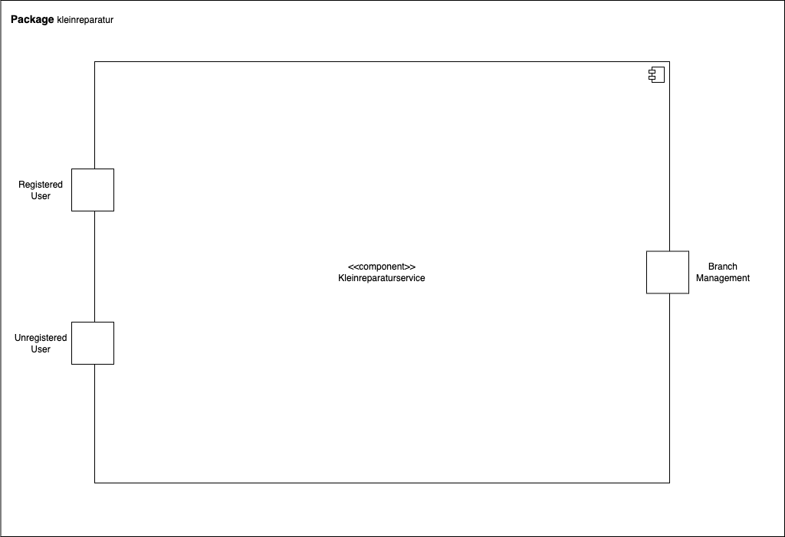

= Pflichtenheft
:doctype: book
:toc: left
:toc-title: Inhaltsverzeichnis
:toclevels: 3
:toc-placement!:
[[Pflichtenheft]]
:project_name: Kleinreparaturen-System
== __{Kleinreparaturen-System}__

[options="header"]
[cols="1, 1, 1, 1, 4"]
|===
|Version | Status       | Bearbeitungsdatum   | Autoren(en)     |  Vermerk
| 1.0    | abgeschlossen| 21.04.2024          | Jannes Schöttke | Initiale Version außerhalb Asciidoc
| 1.2    | In Arbeit    | 24.04.24            | Pascal Jahn, Philipp Danzmann     | Initiale Version
|===

toc::[]

== 1. Zusammenfassung
[[Zusammenfassung]]

Das vorliegende Pflichtenheft definiert die Anforderungen und Ziele für die Entwicklung der geplanten Software. Es legt den Umfang der geplanten Software fest, einschließlich ihrer Funktionalitäten, Leistungen und Schnittstellen. Darüber hinaus werden die Anforderungen an die Benutzerinteraktion sowie die technischen Spezifikationen detailliert beschrieben. Das Pflichtenheft dient als Grundlage für das gesamte Softwareentwicklungsprojekt, indem es ein klares Verständnis der Anforderungen schafft und als Referenzpunkt für die Entwicklung, Qualitätssicherung und Abnahme dient.

== 2. Task Definition
[[Task-Definition]]

Der Auftraggeber, die Miss-Mint-Kette, ist an einen Softwaresystem interessiert, welches die Annahme, Reparaturplanung, Ausgabe und Lagerung von Waren sowie die Verwaltung von Ressourcen (Personal, Arbeitsgerät, Material, Räume) unterstützt und außerdem dem Filialmanagement laufende und akkumulierte Bilanzen zur Verfügung stellt.

Das Ziel dieses Projekts ist die Entwicklung einer umfassenden Softwarelösung für die Verwaltung von Kleinreparaturbetrieben im Rahmen der Miss Mint Mending Points Kette.
Die Software soll alle Aspekte des Betriebs unterstützen, angefangen von der Erstellung von Angeboten sowie der Annahme der Aufträge über die Reparaturplanung bis hin zur Ausgabe und Lagerung. Darüber hinaus soll sie das Filialmanagement bei der Ressourcenverwaltung unterstützen und Bilanzen liefern können.

Konkret sollen folgende Funktionen umgesetzt werden:

1. **Annahme und Abwicklung von Aufträgen:** Die Software soll es ermöglichen, Kundenanfragen entgegenzunehmen, den gewünschten Service zu erfassen und den Preis sofort zu ermitteln. Nach Zahlungseingang erhält der Kunde einen Auftragszettel mit einer eindeutigen Auftragsnummer und dem Fertigstellungstermin.
2. **Reparaturplanung und -ausführung:** Die Software soll die Ressourcenplanung für die verschiedenen Services unterstützen und eine effiziente Zuweisung von Personal und Arbeitsgeräten ermöglichen. Sie soll auch den Fortschritt der Reparaturen verfolgen und eventuelle Verzögerungen dokumentieren.
3. **Lagerverwaltung:** Die Software soll die Lagerung der Waren und die Verwaltung von Aufbewahrungszeiträumen sowie Gebühren unterstützen. Nicht abgeholte Waren sollen automatisch an eine karitative Organisation gespendet werden.
4. **Ressourcenmanagement:** Die Software soll dem Filialmanagement bei der Verwaltung von Personal, Arbeitsgeräten, Material und Räumen helfen. Sie soll außerdem monatliche Reingewinne berechnen und an die Zentrale weiterleiten.
5. **Berichterstattung und Bilanzierung:** Die Software soll dem Filialmanagement laufende und akkumulierte Bilanzen zur Verfügung stellen, um eine effektive Geschäftsplanung und -analyse zu ermöglichen.

Die entwickelte Softwarelösung soll eine effiziente Betriebsführung ermöglichen, die Arbeitsabläufe optimieren und die Kundenzufriedenheit steigern.

== 3. Product Usage
[[Product-Usage]]

Die Softwarelösung, die im Rahmen dieses Projekts entwickelt werden soll, wird in Kleinreparaturbetrieben innerhalb der Miss Mint Mending Points Kette eingesetzt werden.
Diese Betriebe bieten eine Vielzahl von Services an, von der Schuhreparatur bis zur Elektrowerkstatt. Das Hauptziel der Software ist es, die täglichen Abläufe dieser Betriebe digital zu erfassen und dem Management Funktionen zur effizienten Verwaltung von Ressourcen und der Filliale und der Geschäftsplanung zu verfügung zu stellen.

**Kontext und Rahmenbedingungen:**

- **Nutzungskontext:** Die Software wird von Mitarbeitern in den Miss Mint Mending Points-Filialen genutzt, um alle Aspekte des operativen Betriebs zu verwalten, angefangen bei der Angebotserstellung bis zur Ausgabe und Lagerung der reparierten Artikel. Das Filialmanagement wird die Software auch zur Ressourcenverwaltung und Geschäftsanalyse nutzen.
- **Rahmenbedingungen:** Die Nutzung der Software erfolgt in einer typischen Kleinreparaturbetriebsumgebung, in der Mitarbeiter täglich mit Kundeninteraktionen, Reparaturaufträgen und Lagerverwaltungsaufgaben konfrontiert sind. Die Software muss daher benutzerfreundlich, schnell und zuverlässig sein, um den reibungslosen Ablauf der Geschäftsprozesse sicherzustellen.

Die entwickelte Softwarelösung wird integraler Bestandteil des täglichen Betriebs der Miss Mint Mending Points-Filialen sein und dazu beitragen, die Effizienz zu steigern und die Qualität der Services für die Kunden zu verbessern.

== 4. Stakeholders
[[Stakeholders]]
*Verantwortlichkeit: Jannes Schöttke*

Hier wird jede Gruppe oder Person (real oder juristisch) aufgelistet, die einen Einfluss auf die Anforderungen des Systems hat. In der folgenden Tabelle werden diese Interessengruppen aufgelistet, eine Priorität zugewiesen (falls Anforderungen kollidieren sollten, ermöglicht dies eine einfachere Entscheidung) und ihre übergeordneten Ziele beschrieben. Die zugewiesenen Prioritäten reichen von 1 (niedrigste Priorität) bis 5 (höchste Priorität).

[options="header", cols="1,1,1,1"]
|===
| Name
| Priorität (1…5)
| Beschreibung
| Ziele

| Zentrale
| 4
| Der Hauptauftraggeber - formaler Vertragspartner
a|
- Digitalisierung der Geschäftsprozesse
- Vereinheitlichung verwendeter SW
- Automatisierte Berichterstellung
- Erfüllung gesetzl. Vorschriften
- Kostenreduzierung bei Fillialverwaltung

| Fillialmanagement
| 5
| Mitanwender des Softwaresystems - nehmen außerdem teilweise die Rolle des Administrators ein
a|
- Digitale/Einfache Verwaltung der Filiale 
- Vereinfachung der Geschäftsprozesse 
- Übersichtszugewinn

| Mitarbeiter
| 5
| Hauptanwender des Softwaresystems
a| - Reduzierter Arbeitsaufwand für Officetätigkeiten
- Vereinheitlichte GP
- Einfacherere GP
- UX-freundliches System

| Kunde
| 2
| Kunde der Miss Mint Mending Points Filliale
a|
- Schneller & zufriedenstellender Service
- Keine wahrnehmbaren Vorfälle während des Auftrags
- Ganzheitlicher Service
- Gute Service Experience

| Entwickler
| 4
| Mitarbeiter des Auftragnehmers - Verantwortlich für die Entwicklung und ggf. Wartung des Systems
a|
- ordentlich + verständlich dokumentierte Anforderungen
- gute gestafftes Projekt
- realistischer Zeitplan

| Gesetzgeber
| 5
| Einzuhaltende Vorschriften des Gesetzesgebers
| - Datenschutz, etc.
|===

== 5. System Boundaries and Component Structure
[[System-Boundaries-and-Component-Structure]]

=== 5.1 System-Kontext-Diagramm
[[System-Kontext-Diagramm]]
*Verantwortlichkeit: Vihar Kheni*

Figure 1.  System-Kontext-Diagramm des Kleinreparaturen-Systems in UML

Neben der in der Darstellung aufgeführten User sind als Nachbarsysteme eine Datenbank zur persistenten Speicherung der Daten als auch eine Schnittstelle zum Softwaresystem der Zentrale angedacht.

=== 5.2 Top-Level-Architektur
[[Top-Level-Architektur]]
*Verantwortlichkeit: Philipp Danzmann*

Figure 2.  Top-Level-Architektur-Diagramm des Kleinreparaturen-Systems in UML

== 6. Use-Cases
[[Use-Cases]]

Im folgenden Abschnitt werden die notwendigen Anwendungsfälle, die das System zu unterstützen hat, dokumentiert. Die Anwendungsfälle definieren alle essentiellen Funktionen, die das System den Nutzern zu Verfügung stellen können soll.

=== 6.1 Actors
[[Actors]]
*Verantwortlichkeit: Pascal Jahn, Pritkumar Dobariya*

In Form einer Tabelle ist jeder Actor, also Personen, die mit dem System direkt oder indirekt durch andere Services interagieren, aufgelistet. Zu jedem Actor wird eine Beschreibung beigefügt. Falls ein Actor keine spezifische Person, sondern eine Gruppe von Personen oder eine Verallgemeinerung anderer Actors, beschreibt, werden diese _abstract Actors_ mittels _Kursiv_ Schrift verdeutlicht.

[options="header", cols="1,1"]
|===
| Name 
| Description

| _User_
|  Beschreibt jede authentifizierte und unauthentifizierte Person , welche mit dem System interagiert

| _Registered User_
| Alle _User_, die im System registriert sind und sich authentifiziert haben und mit dem System interagieren

| _Unauthenticated User_
| Alle _User_, die nicht authentifiziert sind oder nicht im System registriert sind und mit dem System interagieren

| _Customer_
| Alle _User_, die unauthentifiziert sind und per QR-Code des Bestelltickets auf das System zugreifen. Können Bestellfortschritt einsehen

| _Worker_
| Alle _User_ die als Filialmitarbeiter registriert sind und Bestellungen von Kunden annehmen, bearbeiten und abschließen können

| _Management_
| Ein *User* welchen als Filialleiter registriert ist und administratorrechte über das System hat
|===

=== 6.2 Use-Case Diagram
[[Use-Case-Diagram]]
*Verantwortlichkeit: Pritkumar Dobariya*

Figure 3. Use-Case Diagramm des Kleinreparaturen-Systems in UML

=== 6.3 Use-Case Description
[[Use-Case-Description]]
*Verantwortlichkeit: Pascal Jahn*

In Form einer Tabelle ist jeder Use-Case aus dem oben aufgezeigten Use-Case Diagramm detailliert aufgelistet und definiert.

|===
| ID | ID000
| Name | Geschäftsprozess
| Description | Der Benutzer kann das System öffnen und somit jeglichen beschriebenen Prozess starten
| Actors | User
| Trigger | .exe des Systems wird auf individuellem Client gestartet
| Precondition(s) | das System muss auf dem Server online und durch das Netzwerk erreichbar sein
| Essential Steps | User ist mit seiner Client Maschine in einem Netzwerk, was das System erreichen kann und startet mit einem Doppelklick die .exe Anwendung
| Functional Requirements | User ist in lokalen Netzwerk des Systems und hat eine aktuelle Version der Anwendung auf dem Client-System
|===

|===
| ID | ID001
| Name | Login / Logout
| Description | Der Benutzer kann sich authentifizieren, anmelden und abmelden.
| Actors | User
| Trigger a| 
Login : Ein Benutzer kann auf Funktionen zugreifen, indem er sich anmeldet 
Logout : Nach Nutzung der Funktionen kann der Benutzer die Webseite verlassen indem er sich abmeldet
| Precondition(s) a| 
Login : Noch nicht authentifiziert 
Logout : Der Benutzer ist authentifiziert
| Essential Steps a| 
1. Login:  
- Der Benutzer kann sich über die Navigationsleiste anmelden 
- Der Benutzer kann ein ID-Passwort eingeben 
- Der Benutzer kann die Anmeldeschaltfläche drücken
- Der Benutzer kann die Funktion „Passwort vergessen“ nutzen 
2. Logout: 
- Der Benutzer kann sich von der Navigationsleiste abmelden
- Der Benutzer kann sich abmelden und zur Startseite wechseln
| Functional Requirements | Anwendung wurde erfolgreich gestartet
|===

|===
| ID | ID002
| Name | Passwortwiederherstellung
| Description | kann ein neues Passwort für einen spezifischen User, der im System bereits Registriert ist, anfordern
| Actors | registered User
| Trigger | auf dem Anmeldebildschirm wird auf den Button "Passwortwiederherstellung geklickt"
| Precondition(s) | das Passwort wurde vergessen und der User ist bereits im System registriert
| Essential Steps a| 
1. Auf das Fenster Passwortwiederherstellung" Doppelklick machen 
2. Username eingeben und für diesem User ein neues Passwort beim Systemanfordern (Anfrage an das Filialmanagement zu Autorisierung)
| Extentions | bei vorhandener E-Mail kann einer Mail zur Autorisierung versendet werden und darüber das Passwort zurückgesetzt werden
| Functional Requirements | User ist ein Registered User und kann auf den Login/Logout Bildschirm zugreifen
|===

|===
| ID | ID002
| Name | Mitarbeiterregistrierung
| Description | Ein Management muss in der Lage sein, ein Konto für neue Mitarbeiter zu erstellen
| Actors | Filialmanagement
| Trigger | Ein Filialleiter möchte ein Konto für einen neuen Mitarbeiter erstellen, indem er auf „Registrierung“ klickt
| Precondition(s) | Der Benutzer ist noch nicht angemeldet
| Essential Steps a| 
1. Die Filialleitung drückt auf Registrierung 
2. Es fügt Rolle, Username und Passwort hinzu 
3. Systemprüfung auf eindeutigen Benutzernamen bei Generierung eines neuen Kontos 
4. im Fall von Duplikaten wird eine Fehlermeldung ausgegeben
| Functional Requirements | User mit der Rolle "Filialmanagement" muss authenticated sein und Daten für einen neuen User haben
|===

|===
| ID | ID003
| Name | Bestellübersicht
| Description | Der Kunde kann mehrere Dienste hinzufügen, diese anzeigen lassen und als neue Bestellung aufgeben
| Actors | Worker
| Trigger | Zugriff auf die Funktion „Angebot erstellen“, "Angebot verwalten", "Bestellung verwalten" mittels Doppelklick der jeweiligen Buttons im Menü
| Precondition(s) | Menge und Beschreibung des Services muss vervollständigt sein und User muss als Worker registriert und authentifiziert sein
| Essential Steps a| 
1. Auf der Produktserviceseite kann der Benutzer einen Service zum Warenkorb hinzufügen 
2. Dem Benutzer werden alle ausgewählten Services im Warenkorb mit einem automatisch errechneten Gesamtpreis dargestellt 
3. Der Benutzer kann das Angebot aufgeben indem er den Warenkorb abschließt 
4. Ein Angebot kann bei geleisteter Vorauszahlung zu einer Bestellung umgewandelt werden und diese in ihrem Status verwaltet werden 
| Extentions | zusätzliche Informationen über den Bestellstatus und anfallenden zusätzliche Kosten dem Kunden mittels QR Code übermitteln
| Functional Requirements | einen Worker der auf dem Aktiven System agieren kann, sowie die nötigen Kundeninformationen für Angebote und Bestellungen
|===

|===
| ID | ID013
| Name | Kundenverwaltung
| Description | anlegen und verwalten von Kunden und deren Informationen
| Actors | Worker
| Trigger | ein neuer Kunde schließt eine Bestellung ab
| Precondition(s) | Kunde hatte zuvor noch nie eine Dienstleistung in der Filiale in Anspruch genommen
| Essential Steps | Doppelklick auf das Fenster "neuen Kunden anlegen" innerhalb der Bestellübersicht
| Functional Requirements | Kundendaten müssen vorhanden sein und Worker muss authentifiziert sein
|===

|===
| ID | ID023
| Name | Bestellverwaltung
| Description | Menü zur Verwaltung von Angeboten und Bestellungen
| Actors | Worker
| Trigger | Worker wählt im Hauptmenü die "Bestellübersicht" mittels Doppelklick aus
| Precondition(s) | Worker ist im System authentifiziert
| Essential Steps a| 
1. Worker wählt im Hauptmenü "Bestellübersicht aus" 
2. Worker kann nun im Menü auswählen ob er neues Angebot erstellen will, bestehende Angebote verwalten will oder bestehende Bestellungen verwalten will
3. bestehende Angebote und Bestellungen würde per Listen aufgeführt
| Functional Requirements | bestehende Angebote und Bestellungen müssen korrekt angelegt sein, der Worker muss authentifiziert
|===

|===
| ID | ID033
| Name | Check-Out
| Description | Abschließen einer Bestellung, indem Kunde den reparierten Gegenstand abholt
| Actors | Worker
| Trigger | Kunde kommt in Filiale und holt Gegenstand ab, Worker vermerkt das im System
| Precondition(s) | Bestellung muss angelegt und noch offen und mit dem Status abholbereit sein
| Essential Steps a| 
1. Bestellung wird auf den Status abholbereit gesetzt
2. Kunde kommt in Filiale und begleicht offene Beträge, wie Lagerkosten bei Überschreitung der Lagerzeit, oder bekommt Vergünstigung bei Überzug der Bearbeitungszeit durch die Filiale
3. Worker schließt Bestellung ab und verschiebt Bestellung in Archiv und trägt Gegenstand aus dem Lager aus
| Functional Requirements | Bestellung und Gegenstand müssen angelegt und vorhanden sein, Gegenstand muss repariert sein
|===

|===
| ID | ID004
| Name | Serviceverwaltung
| Description a| 
Alle Mitarbeiter müssen auf den Katalog zugreifen können 
Es werden alle angebotenen Dienste gezeigt 
Der Servicekatalog bietet die Möglichkeit zwischen verschiedenen Arten von Services zu unterscheiden
| Actors | Worker
| Trigger | Verwenden eines Navigationselements, das für die Anzeige des Servicekatalogs verantwortlich ist
| Precondition(s) | Services müssen korrekt eingearbeitet sein, Worker muss einen Service ändern wollen
| Essential Steps a| 
Mitarbeiter klicken auf das Navigationselement (Leistungsliste) 
Dem Benutzer werden alle Dienste der ausgewählten Kategorie angezeigt
| Functional Requirements | Worker muss authentifiziert sein und auf das System zugreifen können
|===

|===
| ID | ID005
| Name | Ressourcenverwaltung
| Description | Anlegen und Verwaltung von Ressourcen einer Filiale
| Actors | Filialmanagement
| Trigger | Manager geht mittels Doppelklick des Fensters "Ressourcenverwaltung" im Hauptmenü in die Ressourcenverwaltung
| Precondition(s) | Manager ist authentifiziert und registriert
| Essential Steps a| 
1. Manager klickt auf das Fenster im Hauptmenü
2. Manager kann nun aus Listen von angelegten Ressourcen auswählen und einzelne Ressourcen verwalten oder neu hinzufügen
| Functional Requirements | existierende Ressourcen müssen korrekt im System angelegt sein
|===

|===
| ID | ID006
| Name | Spende
| Description | spenden eines Gegenstandes bei Überschreitung einer Lagerfrist von 3 Monaten
| Actors | Worker
| Trigger | vorhandener Gegenstand überschreitet Lagerfrist von 3 Monaten gerechnet ab Ablauf der Abholfrist in der Filiale von einer Woche
| Precondition(s) | Gegenstand und dazugehörige Bestellung muss angelegt sein, Zeitstempel des Gegenstandes muss korrekt geführt sein
| Essential Steps a|
1. Gegenstand überschreitet Lagerfrist
2. Worker nimmt den Gegenstand, trägt ihn aus dem Lager aus und überträgt diesen im System an einen Organisation
3. Gegenstand wird an Organisation versendet
| Functional Requirements | Zeitstempel der Einlagerung des Gegenstandes liegt drei Monate zurück
|===

|===
| ID | ID007
| Name | Bilanzerstellung
| Description | automatisch generierte Finanz-Übersicht aus laufenden, abgeschlossenen Bestellungen und laufenden/ variablen Kosten einer Filiale
| Actors | Filialmanagement
| Trigger | fortlaufend automatisierter Prozess für anfallende Kosten oder Einnahmen
| Precondition(s) | das System muss online sein und alle Kosten und Beträge von Bestellungen müssen korrekt eingetragen sein
| Essential Steps | Kosten oder Einnahmen werden durch Bestellungen von Ressourcen, anfallen laufender Kosten oder das Abschließen von Bestellungen im System gespeichert und automatisch vom System in die Finanz-Übersicht eingearbeitet
| Functional Requirements | Kostenfunktionen, sowie Daten über laufende und variable Kosten und Einnahmen müssen vorhanden sein
|===

|===
| ID | ID008
| Name | Materialbestellung
| Description | Eintragen von Bestellung von Ressourcen in das System
| Actors | Filialmanagement
| Trigger | ein Manager bestellt neue Ressourcen und dokumentiert die anfallenden Kosten und neue Ressourcen im System
| Precondition(s) | bestellte Ressource muss beschaffbar und im System angelegt sein
| Essential Steps a| 
1. Manager bemerkt dass Ressourcen fehlen und bestellt werden müssen
2. Bestellt bei Lieferant die Ressource
3. Manager legt die Bestellung bei Lieferant in der Materialbestellung Overlay an und trägt anfallende Kosten ein
| Functional Requirements | Ressourcen müssen im System angelegt sein, Manager muss authentifiziert sein
|===

== 7. Functional Requirements
[[FunctionalRequirements]]
*Verantwortlichkeit: Jannes Schöttke*

Dieser Abschnitt stellt die Version 1 der “Funktionale Anforderungstabelle” dar.
Diese Tabelle enthält folgende Informationen zu den jeweiligen funktionalen Anforderungen:

- Kategorie (Muss- bzw. Kann-Anforderung)
- Komponentenzuordnung
- ID
- Version
- Name
- Input- und Output-Daten sowie gewünschtes Verhalten
- Beschreibung

Es ist zu beachten, dass aufgrund der Verschiedenheit der Anforderungen nicht jede Eigenschaft immer ausgefüllt ist.

[options="header", cols="1,1,1,1,1,1,1,1,1"]
|===
| Kategorie | Zuordnung | ID | Version | Name | Inputdaten | Verhalten (Verarbeitung) | Output | Beschreibung

| Muss | Ressourcen management | F0010 | 1.0 | Benutzerverwaltung | Name, MA-ID, Postition, Studensatz | Erstellt ein Objekt der Klasse MA | MA-Objekt bzw. ID | User müssen angelegt, bearbeitet und gelöscht werden können

| Muss | Annahme | F0020 | 1.0 | Kunden anlegen | Adresse, Name, Emailadresse | Erstellen eines Kundenobjektes | Erstellte KundenID | Kunde muss zur Auftragserstellung im System anlegt sein/werden - damit ID Zuordnung gewährleistet werden kann

| Kann | Reparatur planung | F0040 | 1.0 | Statustracking | Zeitstempel, MA-ID, Checkpoints | Status wird von bearbeitender Abteilung bzw. durch Geschäftslogik geändert | New, open, stored, in repair, complete, expired, donated) | Auswahlfeld für den aktuellen Status des Reparaturauftrags (New, Open, stored, in repair, complete, expired, donated)

| Muss | Annahme | F0050 | 1.0 | Preisermittlung | Gegenstand(Kategorie), Zustand, Service, | Berechnet aus den Inputdaten einen Preis | Preisvorschlag | Zur Angebotserstellung muss ein Preis ermittelt werden - Grundlage: zu erbringender Service

| Kann | Annahme | F0051 | 1.0 | Mengenrabatt | KundenID, Preis | Abrufen kummulierter Kundenumsatz, Ableitung Mengenrabatt, Preisanpassung | Reduzierter Preis |

| Muss | Reparatur planung | F0051 | 1.0 | Berechnung Abholdatum | Service, Zustand, ItemID, Material, MA-ID |  | Abholdatum | Berechnet aus dem Service + zugeordneten MA, dessen Verfügbarkeit, dem Arbeits-/Materialbedarf (in Abhängigkeit der Verfügbarkeit) und der Gegenstandskategorie ein vrsl. Abholdatum

| Muss | Annahme | F0060 | 1.0 | Zeitermittlung | Service, Zustand, Gegenstand | Ermittelt benötigte Zeit | Abholdatum | Zeitschätzung bis zur Fertigstellung

| Muss | Annahme | F0070 | 1.0 | Auftrag anlegen | Übernahme der Angebotsdaten | Erstellen (KundenID), GegenstandsID - Checkbox: Preis bezahlt | AuftragsID | Bestätigung des erstellten Angebots mit eventuell geänderten Daten

| Muss | Annahme | F0080 | 1.0 | Abholschein ausgeben | GegenstandsID | Erstellung QR Code | QR-Code | Es muss in einer beliebigen Form ein Abholschein mit einer ein-indeutigen ID erstellt und ausgegeben werden

| Muss | Annahme | F0090 | 1.0 | Angebot erstellen | Gegenstand(Kategorie), Zustand, Service, Preis, Abholdatum, Zeitstempel | Erstellt ein Objekt der Klasse Angebot | AngebotsID | Setzt sich mind. aus Preis, Zeit und ID zusammen

| Kann | Annahme | F0091 | 1.0 | Angebot erstellen | Gegenstandskategorie, Zustand, Service, Preis, Zeitstempel, | Erstellung eines Angebotsobjekts aus den Inputdaten | Angebotsobjekt + visuelle Darstellung dessen | Weitere optionale Felder für die Angebotserstellung (Bevorzugtes Material, Kommentare, etc.)

| Muss | Architektur | F0110 | 1.0 | Eingabedatenvalidierung | Beliebige Inputdaten | Überprüfung der eingegebenen Daten auf Zweckgebundenheit | Eine bzw. keine Fehlermeldung | Prüfung der Eingabedaten auf Zweckgebundenheit -> Sicherheitsaspekt

| Muss | Lager | F0120 | 1.0 | Lagerverwaltung | ItemID, Zeitstempel | Erstellt aus ItemObject ein LagerObjekt bzw. Eintrag in DB | Erfassung des Gegegenstandes +  Zustände im Lager | Erfassung von Zu- und Abgängen des Lagers (Sowohl Ressourcen als auch Auftragsgegenstände)

| Kann | Ressourcen management | F0121 | 1.0 | Bestellfunktion Material | Art, Menge, Kommentar, Service | Erstellt einen Bestellung aus den Inputdaten (wird an Fillialmanagement gepusht) | Bestellungsformular | Bestellfunktion für Arbeitsgerät; wird in Form eines Bestellformulars an Fillialleitung weiter gegeben

| Kann | Ressourcen management | F0122 | 1.0 | Bestellfunktion Arbeitsgerät | Art, Menge, Kommentar, verwendbarer Service? | Erstellt einen Bestellung aus den Inputdaten (wird an Fillialmanagement gepusht) | Bestellungsformular | Bestellfunktion für Material; wird in Form eines Bestellformulars an Fillialleitung weiter gegeben

| Muss | Architektur | F0130 | 1.0 | Login/Logout-Funktion |  |  |  | inkl. Passwortreset

| Muss | Architektur | F0131 | 1.0 | Benutzervalidierung | Anmeldename + dazugehöriges Passwort | Abgleich der eingegeben Daten mit UserTable (DB) | Check bzw. uncheck zur Weiterverarbeitung der Oberfläche | Abgleich, ob Benutzer mit diesen Daten im System

| Muss | Bilanzierung | F0170 | 1.0 | Kostenerfassung für KLR | per Auftrag: Umsatz, Material- und Personalkosten; pro Filliale/Monat: Betriebskosten Arbeitsgerät, Räume und Anschaffungskosten Arbeitsgerät/12 |  | Gewinn/Verlust pro Monat | Erfassung von Personal-, Material- und Nebenkosten

| Muss | Bilanzierung | F0171 | 1.0 | Erfassung Materialkosten | Materialart,-qualität,-menge |  |  | Ermittelt die Materialkosten einer Filiale/Monat

| Muss | Bilanzierung | F0172 | 1.0 | Erfassung Nebenkosten | aus Preiseigenschaft von RaumObjekt, ArbeitsgerätObjekt, |  |  | Ermittelt Nebenkosten einer Filiale/Monat

| Muss | Bilanzierung | F0173 | 1.0 | Erfassung Personalkosten | MA-ID, Zeitaufwand | for each MI-ID (MI-ID.Stundensatz * kummulierter Zeitaufwand/Monat) | Personalkosten/Monat | Ermittelt die Personalkosten für eine Filiale - benötigt Stundenzähler in MA-ID

| Muss | GUI | F0200 | 1.0 | Login Page |  |  |  | MIN: Username, Passwort, Passwortreset

| Muss | GUI | F0201 | 1.0 | Startpage |  |  |  | MIN: New Offer, New Order, Services, Depot, Filiale (MA, Ressourcen, Finanzen)

| Muss | GUI | F0202 | 1.0 | New Order |  |  |  | MIN: CustomerID, ItemID, Payed?, Comment

| Muss | GUI | F0203 | 1.0 | New Offer |  |  |  | MIN: Itemcategorie, condition, service, quote, estimated time, time stamp

| Muss | GUI | F0204 | 1.0 | Depot |  |  |  | MIN: Database table which stores the different items

| Muss | GUI | F0205 | 1.0 | New Customer |  |  |  | MIN: Name, email, turnover, agreement

| Muss | GUI | F0206 | 1.0 | Ressources |  |  |  | MIN: Arbeitsgerät, Material, Räume

| Muss | GUI | F0207 | 1.0 | Finance |  |  |  | MIN: Listview monthly + yearly (costs + revenue) + Darta

| Muss | GUI | F0208 | 1.0 | Management |  |  |  | Links zu Ressourcen, Finanzen, Mitarbeiter + Diagramm im Inhaltsbereich

| Muss | GUI | F0209 | 1.0 | Object check out |  |  |  |

| Muss | GUI | F0210 | 1.0 | Landingpage |  |  |  | Eingeschränkte View; nur Optionen ServiceCatalog einzusehen + Login/Register

| Muss | GUI | F0211 | 1.0 | Register User |  |  |  | MIN: First & Last name, username, Password, Terms&Conditions

| Muss | Ressourcen management | F0270 | 1.0 | Serviceverwaltung |  |  |  | Bearbeiten von Services

| Muss | Ressourcen management | F0280 | 1.0 | Personalverwaltung |  |  |  | Erstellen, bearbeiten und löschen von MA-Objekten (nur durch Fillialmanagement)

| Muss | Ressourcen management | F0290 | 1.0 | Geschäftsraumverwaltung |  |  |  | Erstellen, bearbeiten und löschen von Geschäftsräumen (nur durch Fillialmanagement)

| Muss | Ressourcen management | F0300 | 1.0 | Arbeitsgeräteverwaltung |  |  |  | Erstellen, bearbeiten und löschen von Geschäftsräumen (durch autorisierte MA)

| Muss | Ressourcen management | F0310 | 1.0 | Zuweisung freier MA | Datum, Dauer (Abgeleitet von Service + Zustand), Prio? |  | Setzt MA für Dauer auf NA | Ermöglicht transparentes Ressourcenmanagement durch Ressourcenbuchung

| Muss | Ressourcen management | F0311 | 1.0 | Buchung Arbeitsgerät | Kategorie, ArbeitsgerätID, Dauer |  | Setzt Arbeitsgerät für Dauer auf NA | Ermöglicht transparentes Ressourcenmanagement durch Ressourcenbuchung

| Kann | Ressourcen management | F0311 | 1.0 | Neuzuweisung freier MA |  |  |  | Für den Fall, dass zugewiesener MA nicht verfügbar ist

| Muss | Ressourcen management | F0312 | 1.0 | Buchung Materialbedarf | Art, Menge, Kommentar |  | Reduziert Materialart um Menge | Ermöglicht transparentes Ressourcenmanagement durch Ressourcenbuchung

| Muss | Ressourcen management | F0313 | 1.0 | Buchung Raum/Arbeitsplatz | Dauer, Kommentar/Hinweise |  | Setzt Raum/Arbeitsplatz für Dauer auf NA | Ermöglicht transparentes Ressourcenmanagement durch Ressourcenbuchung
|===

== 8. Non-Functional Requirements
[[NonFunctionalRequirements]]
*Verantwortlichkeit: Pascal Jahn*

Die nicht funktionalen Anforderungen des Managementsystems beschreiben Anforderungen, welche das System in **Stabilität**, **Arbeitsweise** und unter verschiedenen Szenarien definieren.

=== 8.1 Quality Demands
[[QualityDemands]]

Die folgenden qualitativen Anforderungen sind in Form einer Tabelle aufgeführt. Dabei wird jede nicht funktionalen Anforderung gewichtet, was die spätere Formulierung konkreter NF Anforderungen beeinflussen muss.

1 = unwichtig ... 5 = sehr wichtig

[options="header", cols="1,1,1"]
|===
| Qualitative Anforderung | Gewichtung | Beschreibung

| Bedienbarkeit | 4 | das Managementsystem muss sowohl für ältere Mitarbeiter, die nicht viel Erfahren mit Informationssystemen haben, als auch für alle Kunden intuitiv zu verstehen und bedienen sein

| Effizienz/ Automatisierung | 3 | Zeitbasierte Datenverwaltung von Bestellung und Nutzerdaten

| Sicherheit | 3 | Datenschutz und somit die Sicherheit persönlicher Daten von Kunden ist sehr wichtig, jedoch sind interne Daten von Prozessen der Dienstleistungen nicht kritisch

| Skalierbarkeit | 4 | Das System muss auf eine wachsende Anzahl kleiner Filialen unterstützen und muss somit primär für interne Finanzen und Ressourcenverwaltung gut skalierbar sein

| Verfügbarkeit | 4 | da Kunden online Bestellungen aufgeben können sollen und Kunden jederzeit ihren Auftragsfortschritt einsehen sollen ist uptime dieses Systems zu maximieren
|===

== 8.2 Concrete NF Requirementsn
[[ConcreteNFRequirements]]

[options="header", cols="1,1,1,1"]
|===
| ID | Version | Name | Beschreibung

| [NF0010] | v 0.1 | Verfügbarkeit/ uptime | Das System sollte eine Uptime größer gleich 99% haben

| [NF0020] | v 0.1 | Sicherheit/ Nutzerdatenverwaltung | Nutzerdaten können nur mit Einverständnis des Kunden und nur für eine bestimmte Zeit in einer Datenbank gespeichert werden

| [NF0030] | v 0.1 | Effizienz/ Datenverwaltung | abgeschlossene oder abgelaufene Bestellungen sollten nach Bestimmter Zeit aus dem System entfernt werden oder archiviert werden, manuelle Inventarverwaltung zu erleichtern

| [NF0040] | v 0.1 | Sicherheit/ Passwort | Passwörter sollen zur Systemsicherheit und gegen Identitätsdiebstahl nur in Hash-Werten gespeichert werden

| [NF0050] | v 0.1 | Bedienbarkeit/ GUI | das Anlegen einer Bestellung mit dem Kunden Vorort soll während der Kundeninteraktion die wenigste Zeit in Anspruch nehmen
|===

== 9. GUI-Prototyp
[[GUIPrototyp]]
*Verantwortlichkeit: Vihar Kheni, Jannes Schöttke*

image::models/pages/langingpage.png[]
Figure 4. Abbildung eines Gui-Prototyps der Landing-Page

image::models/pages/registeruser.png[]
Figure 5. Abbildung eines Gui-Prototyps der User-Registrierungs-Page

image::models/pages/authenticated.png[]
Figure 6. Abbildung eines Gui-Prototyps der Startseite und dem Service-Katalog-Page

image::models/pages/newoffer.png[]
Figure 7. Abbildung eines Gui-Prototyps der Angebotserstellungs-Page

image::models/pages/neworder.png[]
Figure 8. Abbildung eines Gui-Prototyps der Bestellungsverwaltungs-Page

image::models/pages/depot.png[]
Figure 9. Abbildung eines Gui-Prototyps der Lagerverwaltungs-Page

image::models/pages/ressources.png[]
Figure 10. Abbildung eines Gui-Prototyps der Ressourcenverwaltungs-Page

image::models/pages/checkout.png[]
Figure 11. Abbildung eines Gui-Prototyps des Check-Out-Page

image::models/pages/management.png[]
Figure 12. Abbildung eines Gui-Prototyps der Filialverwaltungs-Page

image::models/pages/logout.png[]
Figure 13. Abbildung eines Gui-Prototyps der Logout-Page

== 10. Data-Model
[[DataModel]]

=== 10.1 Class-Diagram
[[Datenmodell]]
*Verantwortlichkeit: Philipp Danzmann, Jannes Schöttke*

Figure 2. Datenmodell des Kleinreparaturen-Systems in UML

=== 10.2 Classes and Enumerations
[[DatenKlassenbeschreibung]]
*Verantwortlichkeit: Pascal Jahn*

Folgende Tabelle stellt eine eindeutige Übersicht aller Klassen/Enums auf, die Verwendung in dem domain model finden. Die Tabelle ist Teil der Dokumentation und dient der Information der Stakeholder über Zentrale Begriffe und Konzepte des Aufbau des Systems.

[options="header", cols="1,1"]
|===
| Enumerations
| Description

| Filialmanagementsystem
| Hauptklasse des Systems, welches eine reale Kleinreparaturen Filiale beschreibt

| Finanzbuchhaltung
| Repräsentation eines Buchungssystems mit automatisierten Einfangprozessen und Übersichterstellung

| Lager
| Repräsentation eines Verzeichnisses an in System gespeicherten Items

| Item
| Repräsentation eines zur Reparatur abgegebenen Gegenstandes

| → ITEMID
| Repräsentation einer Kennnummer des abgegebenen Reparaturgegenstandes

| → KATEGORIE
| Repräsentation einer Zuordnung zu nötigen Services

| → ZUSTAND
| Einschätzung der Reparierbarkeit in einen originalzustand

| → BILD
| Repräsentation eines Fotos des physischen Gegenstandes nach der Abgabe

| Service Catalog
| Repräsentation eines Verzeichnisses an im System angelegten Services

| Service
| Repräsentation der angebotenen Services mittels einem Namen, Preis und einer Beschreibung möglicher Dienstleistungen

| → NAME
| Kenn-Name eines im System vermerkten Services

| → PREIS
| pauschaler Grundpreis eines im System vermerkten Services

| Bestellübersicht
| Repräsentation der Verwaltung und Erstellung von Offer und Order

| → COMMENT
| Repräsentation von Vermerkungen und Kommentaren einer Angebote und Bestellungen

| Offer
| Repräsentation eines eingegangenen Angebots

| → OFFERID
| Repräsentation einer Kennnummer des Angebots

| → PREIS
| Repräsentation einer für den Bestellabschluss zu vorauszahlenden Summe

| Order
| Repräsentation einer laufenden Bestellung nach Angebotsbestätigung

| → ORDERID
| Repräsentation einer Kennnummer einer spezifischen Bestellung

| → ZEITSTEMPEL
| Repräsentation eines Datums der letzten Statusänderung

| → STATUS
| Repräsentation des Bearbeitungsstatus einer Bestellung eines Kunden [Open, Complete, Stored, Expired]

| Kunden
| Repräsentation einer Realen Person, die Kunde, also Auftraggeber, mittels einer Bestellung bei einem Repair-Shop ist

| → KundenID
| Repräsentation einer Kennnummer eines Kunden

| Ressourcen
| Repräsentation von realen betriebseigenen Arbeitsmitteln

| Arbeitsgerät
| Repräsentation von Werkzeugen und anderen betriebseigenen Gerätschaften, die in einer Filiale vorhanden sind

| Material
| Repräsentation von physischen betriebseigenen Material, was betrieblichen Zwecken dient

| Räume
| Repräsentation von physischen Orten einer Filiale, die unter betrieblicher Verwendung stehen

| User
| Repräsentation einer realen Person

| Registered User
| Repräsentation einer realen Person, die im System registriert ist und mittels Login sich authentifizieren können

| → USERNAME
| Name einer realen Person, mit der diese im System eingetragen ist

| → PASSWORD
| Passwort das eine registrierte Person in Verbindung mit dem USERNAME im Login authentifiziert

| → ADRESS
| Repräsentation der Rolle und Rechten eines spezifischen Users

| Mitarbeiter
| Repräsentation eines realen Mitarbeiters

| → ID
| Repräsentation einer Kennnummer eines spezifischen Mitarbeiters im System

| Filialmanagement
| Repräsentation einer realen Filialleitung

| → ID
| Repräsentation einer Kennnummer eines spezifischen Filialmanagements im System
|===

== 11. Acceptance Testing
[[AcceptanceTesting]]
*Verantwortlichkeit: Pritkumar Dobariya*

An dieser Stelle wird von einer detaillierten Ausführung der Akzeptanztestfälle abgesehen, da diese in Grundzügen bereits in den Use Cases beschrieben sind. Eine detaillierte Beschreibung wird jedoch im Rahmen der zu erstellenden technischen Dokumentation angefertigt werden. 

== 12. Comments
[[Comments]]

- Eine abweichende Verwendung der Begriffe Management, Filialleitung und Filialmanagement in den Diagrammen ist aufgrund der unterschiedlichen Perspektive möglich. Diese sind jedoch als synonym zu betrachten und weisen auf die gleiche Stakeholder-Gruppe hin.
